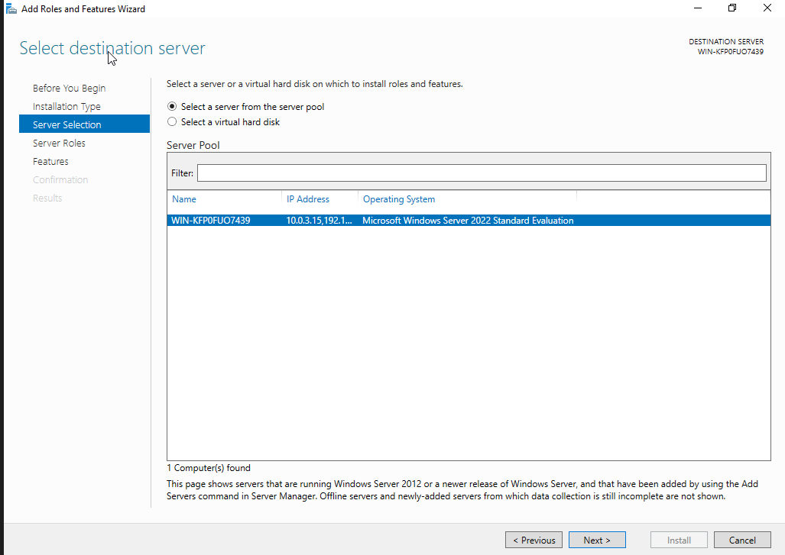
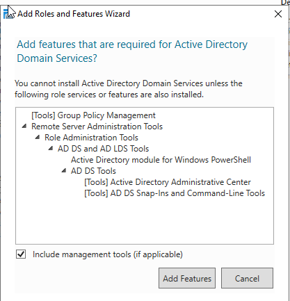
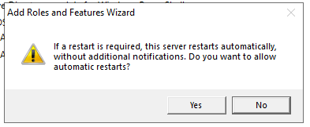
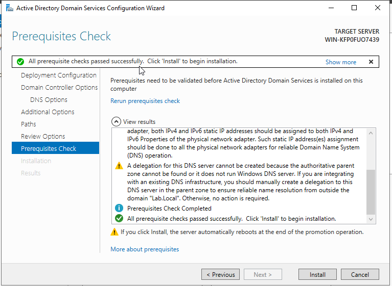
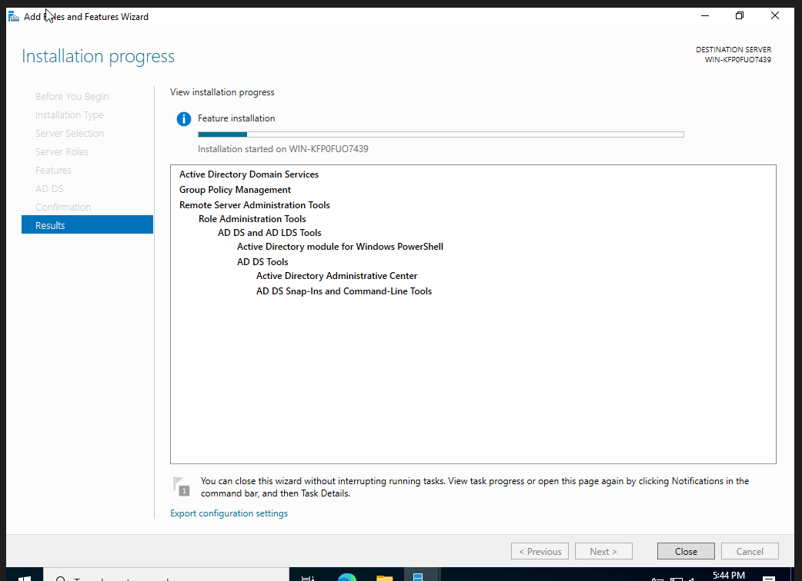

# 01 - Active Directory Domain Services Installation

## Objective

Install the Active Directory Domain Services (AD DS) role on a Windows Server 2022 system in preparation for promoting the server to a Domain Controller.

---

## Why This Matters

Active Directory Domain Services is the foundation of identity and access management in Microsoft environments. Nearly every enterprise Windows network relies on Active Directory to manage users, computers, groups, authentication, authorization, and security policies.

---

## Step 1 - Verify Virtual Machine Configuration

Before beginning installation, the Windows Server 2022 virtual machine was reviewed to ensure appropriate resources were allocated.

This verification helps ensure the server can support Active Directory services and prevents resource-related issues during deployment.

---

## Step 2 - Launch the Add Roles and Features Wizard

Server Manager was opened and the Add Roles and Features Wizard was launched.

The wizard provides a guided method for installing Windows Server roles and features.

---

## Step 3 - Select the Installation Destination

The local server was selected as the installation target.

This confirms which server will receive the Active Directory Domain Services role.

---

## Step 4 - Select Active Directory Domain Services

The Active Directory Domain Services role was selected from the available server roles.

When selected, Windows identified additional dependencies required for AD DS.

These management tools are necessary for administering Active Directory after installation.

---

## Step 5 - Review Additional Features

The feature selection screen was reviewed.

No additional features beyond those required by Active Directory were selected.

---

## Step 6 - Review Installation Confirmation

The installation summary was reviewed before deployment.

The automatic restart option was also confirmed.

This ensures the server can reboot if required during the installation process.

---

## Step 7 - Run Prerequisite Validation

Windows performed prerequisite checks before beginning installation.

Validating prerequisites helps identify configuration issues before Active Directory services are deployed.

---

## Step 8 - Install Active Directory Domain Services

The installation process was initiated.

Windows copied files, configured services, and installed the AD DS role.

---

## Step 9 - Verify Successful Installation

Installation completed successfully.

The required Active Directory administrative tools were also installed.

This confirmed the server was ready for Domain Controller promotion.

---

## Skills Demonstrated

- Windows Server Administration
- Active Directory Domain Services Installation
- Role-Based Service Deployment
- Server Manager Administration
- Infrastructure Preparation
- Enterprise Identity Management Fundamentals

---

## Outcome

The Windows Server 2022 system was successfully prepared for Domain Controller promotion by installing Active Directory Domain Services and all required management tools.

The next phase of the project focuses on promoting the server into the first Domain Controller of a new Active Directory forest.
