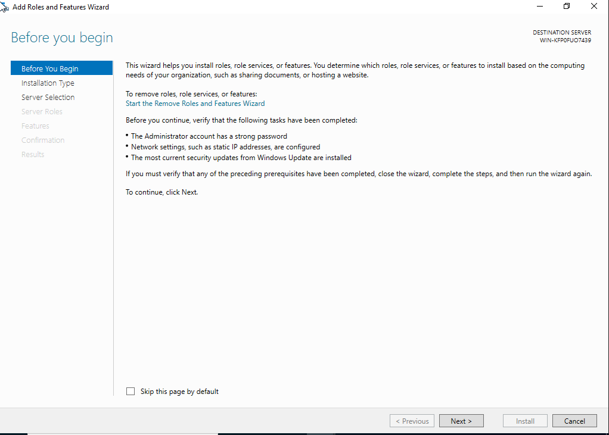

# Active Directory Administration Lab

## Project Summary

This project demonstrates the deployment, configuration, and administration of a Windows Server Active Directory environment.

The objective was to build a functional enterprise identity infrastructure capable of supporting centralized authentication, user administration, Organizational Units (OUs), Group Policy Objects (GPOs), and DNS services.

This environment simulates many of the core responsibilities performed by enterprise support technicians, systems administrators, and help desk professionals.

---

## Environment Overview

### Core Components

* Windows Server Domain Controller
* Active Directory Domain Services (AD DS)
* DNS Services
* Organizational Units (OUs)
* User Administration
* Group Administration
* Group Policy Objects (GPOs)
* Windows Client Workstation

---

## Skills Demonstrated

* Active Directory Administration
* Windows Server Administration
* Domain Controller Deployment
* DNS Configuration
* Organizational Unit Design
* User Lifecycle Management
* Group Administration
* Password Management
* Account Lockout Management
* Group Policy Administration
* Authentication Validation
* Enterprise Documentation

---

# Implementation Highlights

## Phase 1 – Active Directory Domain Services Installation

The first phase involved preparing the Windows Server environment and installing Active Directory Domain Services (AD DS).

### Activities Performed

* Prepared Windows Server virtual machine
* Installed Active Directory Domain Services
* Added required administrative tools
* Validated installation prerequisites
* Completed AD DS deployment

### Evidence

*Windows Server virtual machine prepared for Active Directory deployment.*

*Server Manager installation wizard initiated.*

*Active Directory Domain Services selected for installation.*

*Required Active Directory features selected.*

*Administrative tools automatically installed.*

*Active Directory Domain Services successfully installed.*
---

## Phase 2 – Domain Controller Promotion

The server was promoted to a Domain Controller and configured as the foundation of the domain infrastructure.

### Activities Performed

* Created a new forest
* Configured root domain
* Configured Domain Controller options
* Established DSRM credentials
* Configured DNS settings
* Established NetBIOS naming
* Validated domain and forest functional levels
* Completed Domain Controller promotion

---

## Phase 3 – Organizational Unit Structure

Organizational Units were created to simulate departmental administration and provide logical separation for users and resources.

### Activities Performed

* Created departmental Organizational Units
* Designed hierarchical OU structure
* Configured Operations OU
* Enabled accidental deletion protection
* Organized administrative structure

---

## Phase 4 – User and Group Administration

User and group administration tasks were performed to simulate common enterprise support responsibilities.

### Activities Performed

* Created security groups
* Created user accounts
* Assigned group memberships
* Managed user placement within OUs
* Disabled user accounts
* Performed password resets
* Investigated account lockouts
* Validated password policy enforcement

---

## Phase 5 – Group Policy Administration

Group Policy Objects were created and linked to Organizational Units to centrally manage user settings.

### Activities Performed

* Created Group Policy Objects
* Configured logon message settings
* Linked policies to Organizational Units
* Validated policy deployment

---

## Phase 6 – Validation and Testing

The environment was validated through DNS testing, authentication testing, domain joins, connectivity testing, Group Policy verification, and security validation.

### Validation Activities

* Domain join testing
* DNS validation
* Client authentication testing
* Group Policy verification
* GPUpdate testing
* GPResult validation
* Event Viewer review
* Final access validation

---

## Deliverables

* Screenshots
* Documentation
* Implementation Guides
* Validation Evidence

---

## Project Outcome

A fully functional Active Directory environment was successfully deployed and validated.

The environment now supports:

* Centralized Authentication
* User Administration
* Group Administration
* DNS Services
* Group Policy Enforcement
* Enterprise Identity Management

---

## Lessons Learned

* Active Directory depends heavily on proper DNS configuration.
* Organizational Unit planning simplifies administration.
* Group Policy provides centralized configuration management.
* Identity administration requires consistent documentation and validation.
* Testing is critical before implementing administrative changes.

---

## Portfolio Reflection

This project provided practical experience with the core administrative functions that support enterprise Windows environments.

While Active Directory concepts can be learned from documentation alone, building and validating a functional environment reinforced how identity management, authentication, DNS, Group Policy, and administrative workflows operate together in real-world enterprise environments.

The project highlighted the importance of documentation, validation, and structured administration practices.

---

## Next Steps

This project supports future portfolio sections:

* Enterprise Support Labs
* Help Desk Operations
* Networking Labs
* osTicket Service Desk Labs
* Enterprise Systems Administration Projects
