# Active Directory Administration Lab

## Project Summary

This project demonstrates the deployment, configuration, and administration of a Windows Server Active Directory environment.

The objective was to build a functional enterprise identity infrastructure capable of supporting centralized authentication, user administration, Organizational Units (OUs), Group Policy Objects (GPOs), and DNS services.

This environment simulates many of the core responsibilities performed by enterprise support technicians, systems administrators, and help desk professionals.

---

## Environment Overview

### Core Components

* Windows Server Domain Controller
* Active Directory Domain Services (AD DS)
* DNS Services
* Organizational Units (OUs)
* User Administration
* Group Administration
* Group Policy Objects (GPOs)
* Windows Client Workstation

---

## Skills Demonstrated

* Active Directory Administration
* Windows Server Administration
* Domain Controller Deployment
* DNS Configuration
* Organizational Unit Design
* User Lifecycle Management
* Group Administration
* Password Management
* Account Lockout Management
* Group Policy Administration
* Authentication Validation
* Enterprise Documentation

---

# Implementation Highlights

## Phase 1 – Active Directory Domain Services Installation

The first phase involved preparing the Windows Server environment and installing Active Directory Domain Services (AD DS).

### Activities Performed

* Prepared Windows Server virtual machine
* Installed Active Directory Domain Services
* Added required management tools
* Validated installation prerequisites
* Completed AD DS deployment

### Evidence

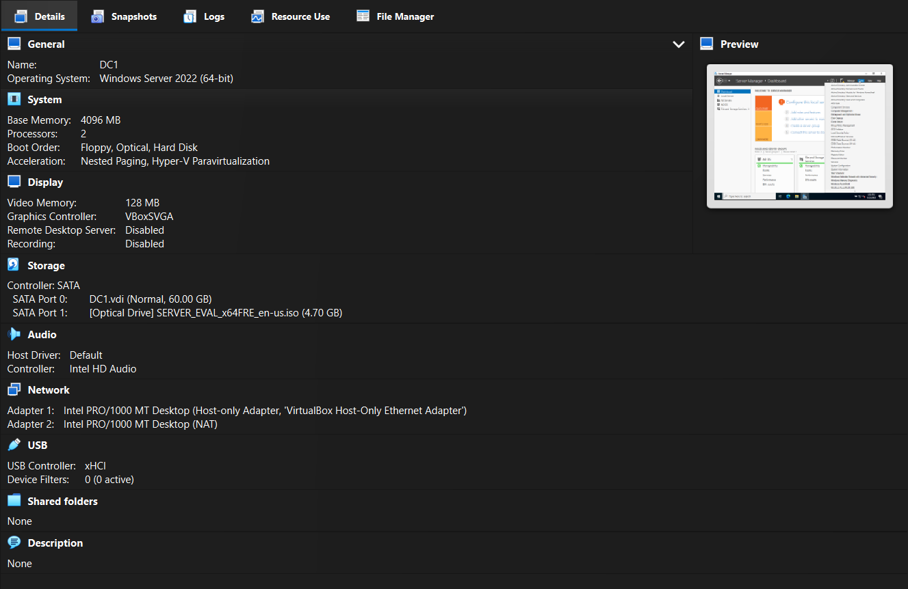

*Windows Server virtual machine prepared for Active Directory deployment.*

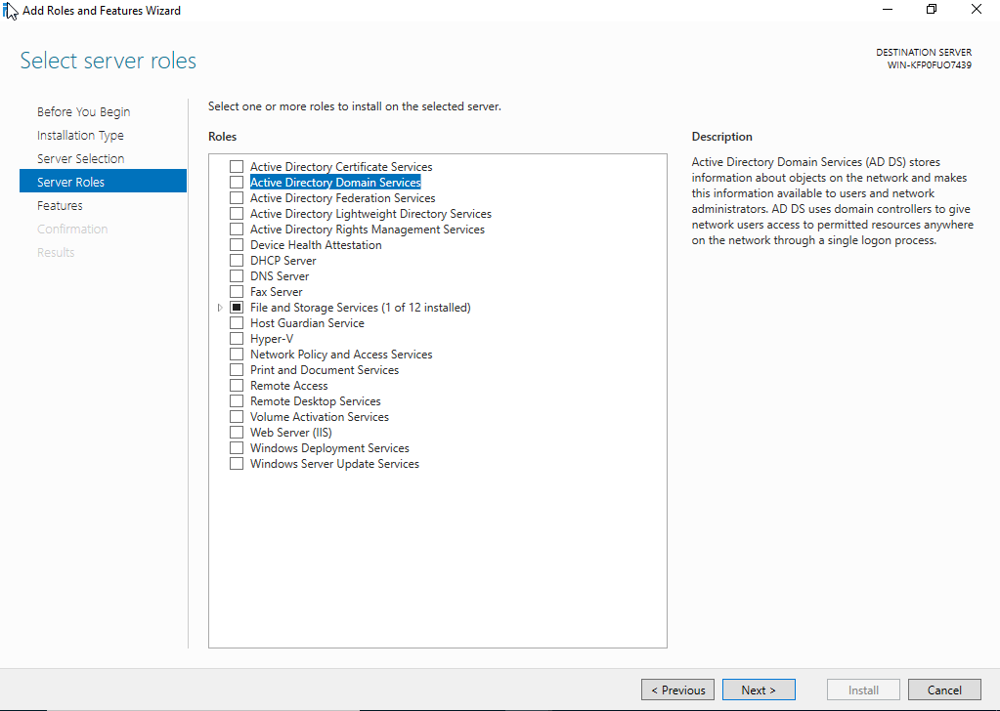

*Active Directory Domain Services selected for installation.*

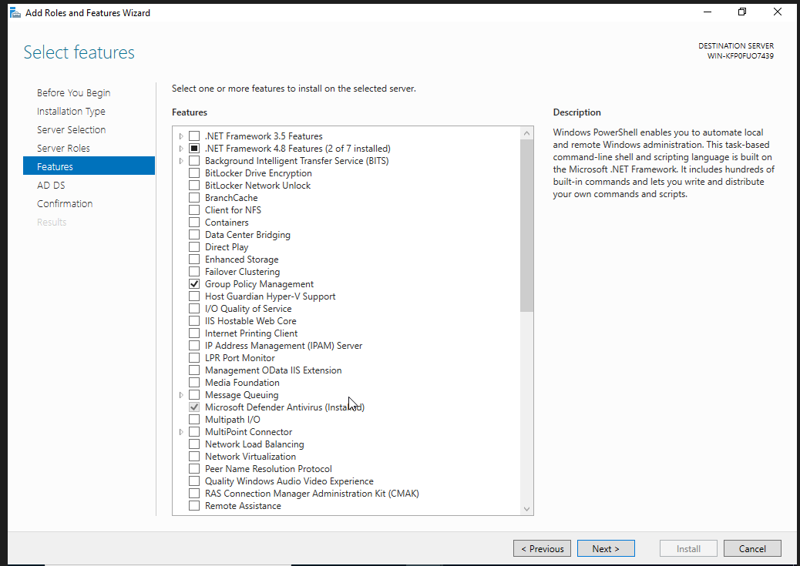

*Required Active Directory management features selected.*

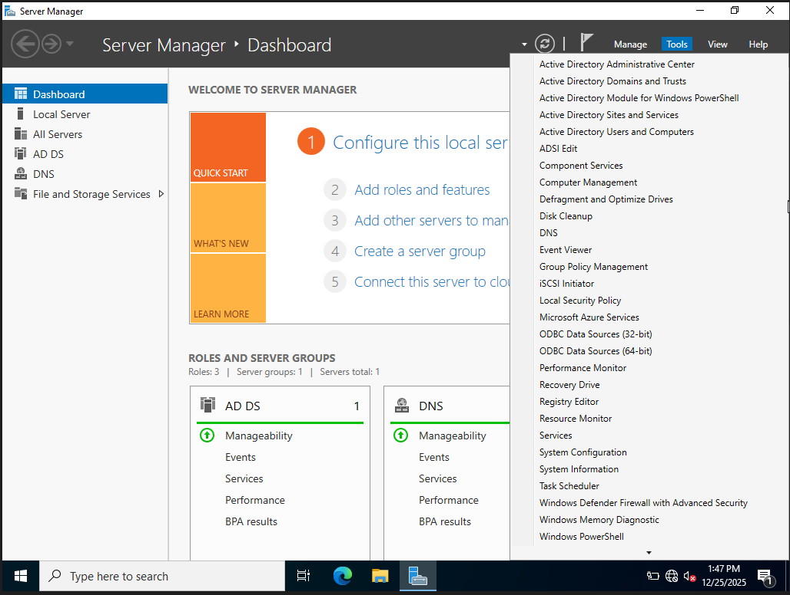

*Administrative tools installed automatically to support Active Directory management.*

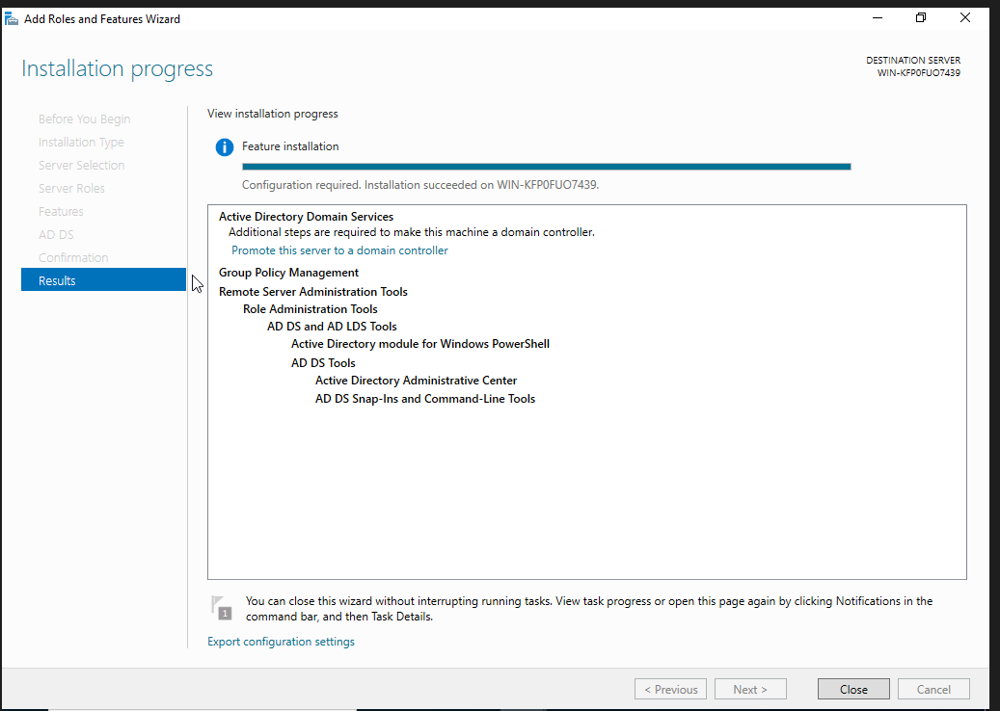

*Active Directory Domain Services installation completed successfully.*

---

## Phase 2 – Domain Controller Promotion

The server was promoted to a Domain Controller and configured as the foundation of the enterprise identity infrastructure.

### Activities Performed

* Created a new forest
* Configured the root domain
* Configured Domain Controller options
* Established DSRM credentials
* Configured DNS settings
* Configured NetBIOS naming
* Validated domain and forest functional levels
* Completed Domain Controller promotion

### Evidence

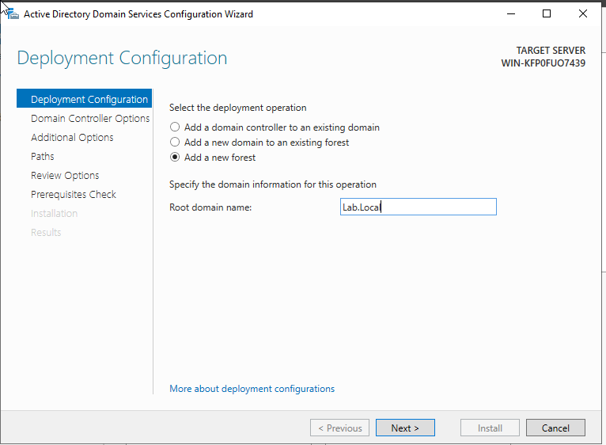

*New Active Directory forest creation initiated for the enterprise environment.*

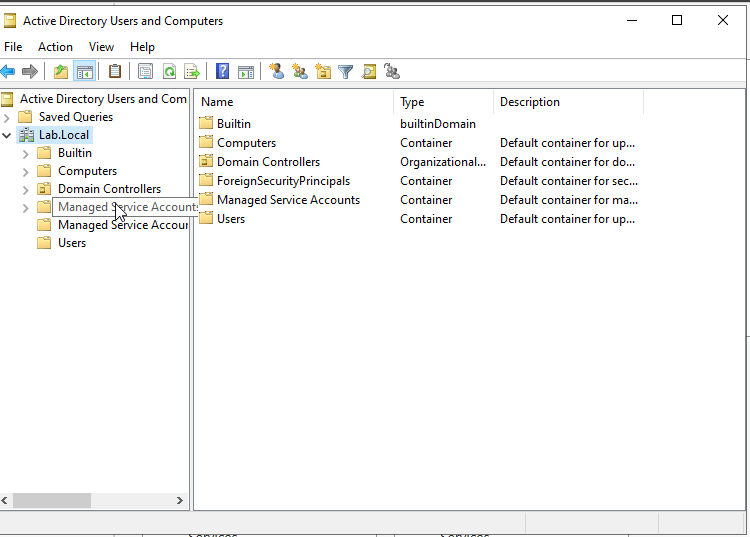

*Root domain configured as the foundation of the Active Directory environment.*

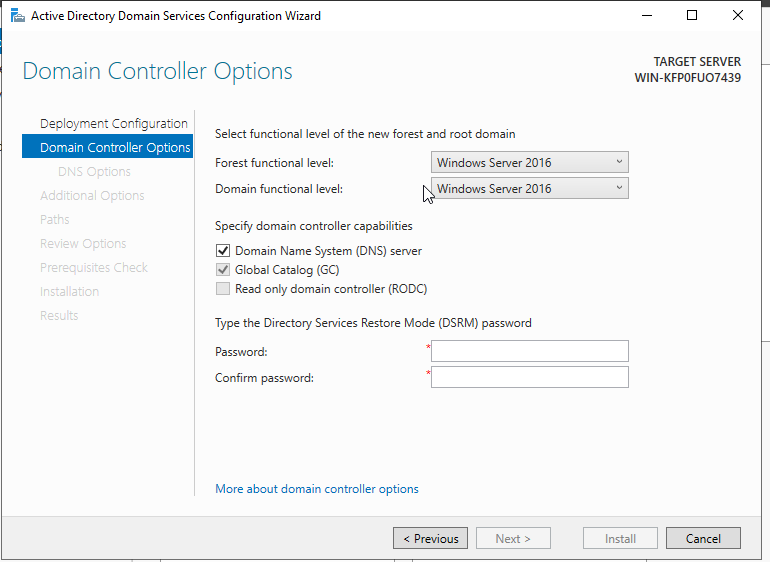

*Domain Controller options configured, including DNS integration and functional level settings.*

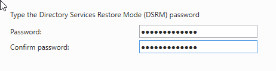

*Directory Services Restore Mode (DSRM) credentials configured for disaster recovery operations.*

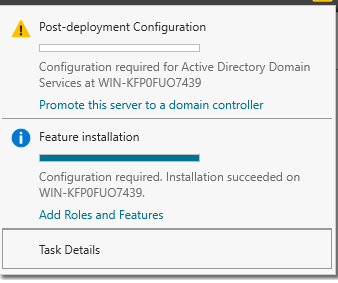

*Post-deployment configuration completed and server successfully promoted to a Domain Controller.*

---

## Phase 3 – Organizational Unit Structure

Organizational Units were created to simulate departmental administration and logical separation of resources.

### Activities Performed

* Created root Organizational Units
* Created departmental Organizational Units
* Implemented administrative hierarchy
* Enabled accidental deletion protection
* Organized administrative structure

### Evidence

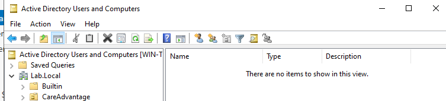

*Root Organizational Unit structure created to establish administrative boundaries within the domain.*

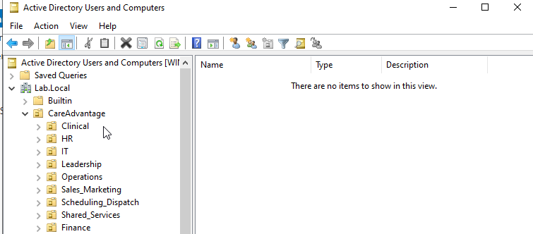

*Departmental Organizational Units created to separate business functions and administrative responsibilities.*

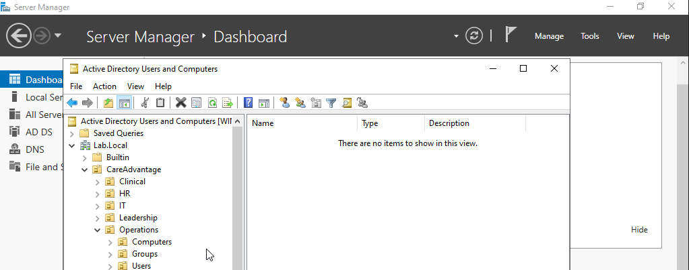

*Child Organizational Units created beneath Operations to support scalable administration and delegation.*

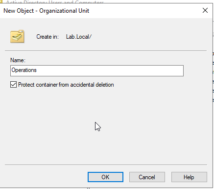

*Accidental deletion protection enabled to safeguard critical Active Directory objects.*

---

## Phase 4 – User and Group Administration

User and group administration tasks were performed to simulate common enterprise support responsibilities.

### Activities Performed

* Created security groups
* Created user accounts
* Assigned group memberships
* Managed OU placement
* Disabled accounts
* Reset passwords
* Investigated account lockouts
* Validated password policy enforcement

### Evidence

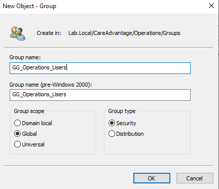

*Security group created to support role-based access management within the Operations department.*

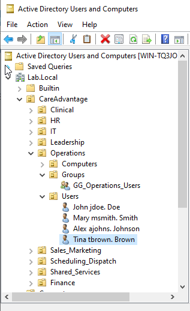

*User accounts successfully created and organized within the Operations Organizational Unit.*

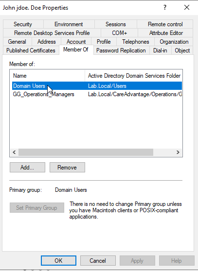

*User group membership validated to ensure appropriate access assignment.*

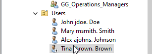

*User account disabled as part of standard account lifecycle management procedures.*

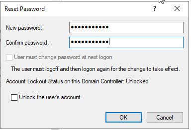

*Password reset performed in accordance with common help desk support workflows.*

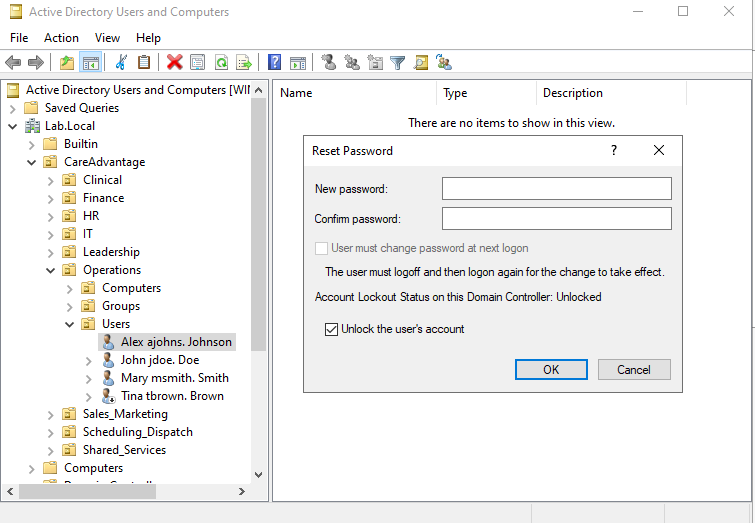

*Account lockout reviewed and investigated using Active Directory administrative tools.*

---

## Phase 5 – Group Policy Administration

Group Policy Objects were created and linked to Organizational Units to centrally manage user settings.

### Activities Performed

* Created Group Policy Objects
* Configured logon message settings
* Linked GPOs to Organizational Units
* Validated policy deployment

### Evidence

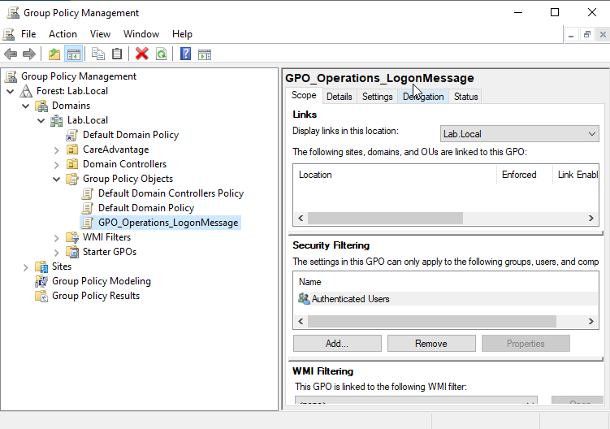

*Group Policy Object created to centrally manage user settings within the Operations Organizational Unit.*

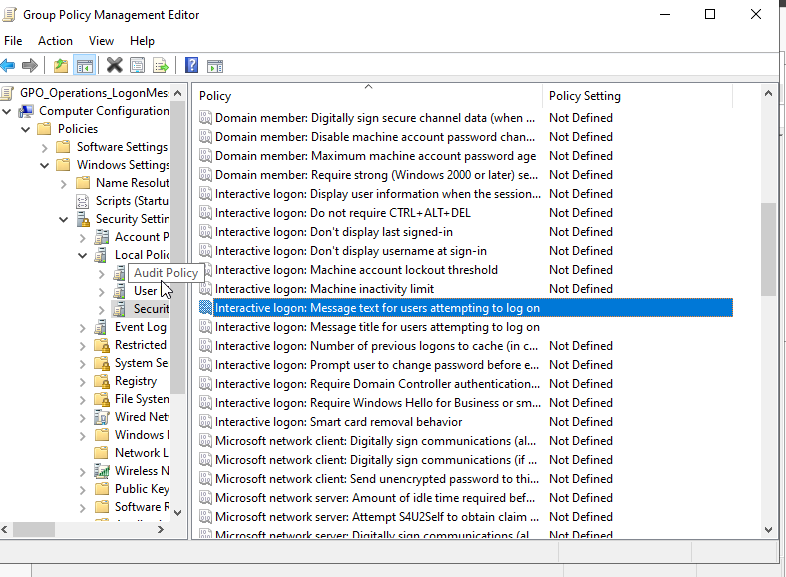

*Interactive logon message configured through Group Policy Management to demonstrate centralized policy administration.*

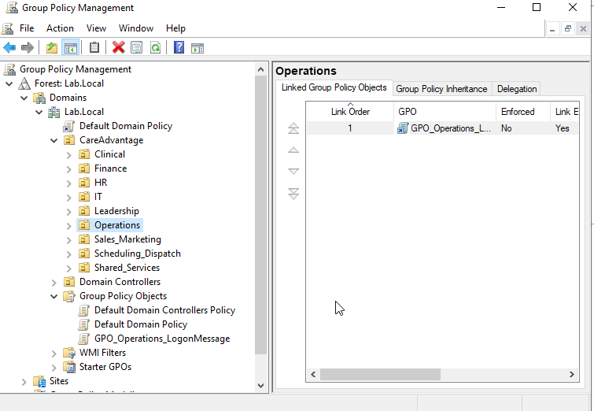

*Group Policy Object successfully linked to the Operations Organizational Unit for policy enforcement.*

---

## Phase 6 – Validation and Testing

The environment was validated through authentication testing, DNS testing, domain joins, Group Policy verification, and security validation.

### Validation Activities

* Domain join validation
* DNS verification
* Authentication testing
* GPResult validation
* GPUpdate validation
* Event Viewer verification
* Security validation
* Final access validation

### Evidence

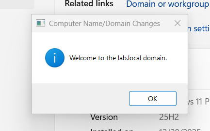

*Windows client successfully joined to the Active Directory domain.*

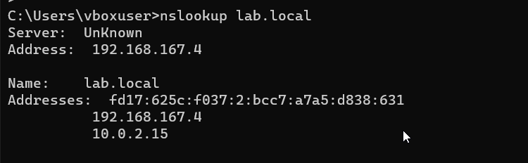

*DNS resolution validated through successful name resolution of the Domain Controller.*

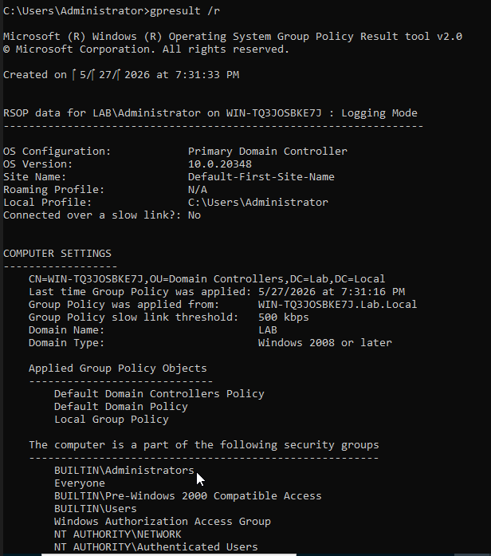

*Group Policy processing verified through GPResult reporting.*

*Group Policy refresh successfully executed using GPUpdate.*

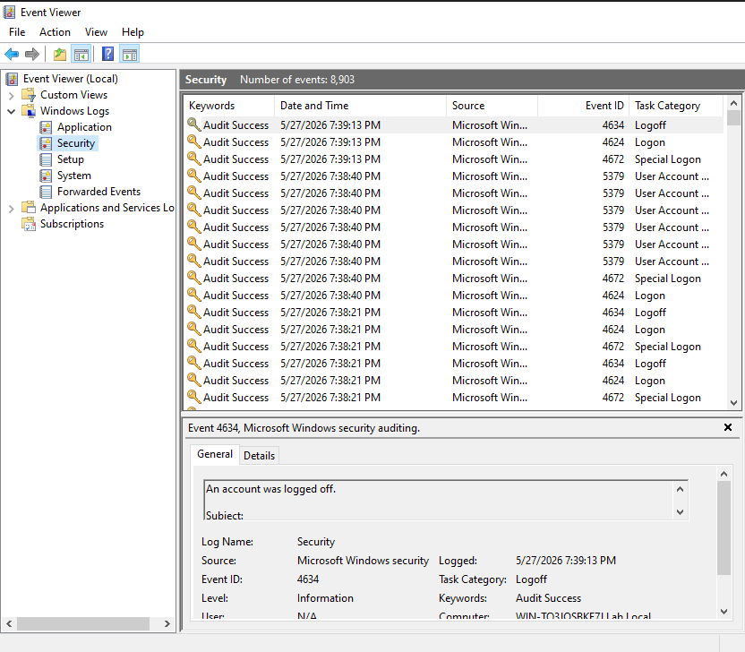

*Security-related events reviewed through Windows Event Viewer.*

*Final validation confirmed successful authentication, authorization, and policy enforcement throughout the environment.*
*Final validation confirmed successful authentication, authorization, and policy enforcement throughout the environment.*
---

## Deliverables

* Screenshots
* Documentation
* Implementation Guides
* Validation Evidence

---

## Project Outcome

A fully functional Active Directory environment was successfully deployed and validated.

The environment now supports:

* Centralized Authentication
* User Administration
* Group Administration
* DNS Services
* Group Policy Enforcement
* Enterprise Identity Management

---

## Lessons Learned

* Active Directory depends heavily on proper DNS configuration.
* Organizational Unit planning simplifies administration.
* Group Policy provides centralized configuration management.
* Identity administration requires consistent documentation and validation.
* Testing is critical before implementing administrative changes.

---

## Portfolio Reflection

This project provided practical experience with the core administrative functions that support enterprise Windows environments.

While Active Directory concepts can be learned from documentation alone, building and validating a functional environment reinforced how identity management, authentication, DNS, Group Policy, and administrative workflows operate together in real-world enterprise environments.

The project highlighted the importance of documentation, validation, and structured administration practices.

---

## Next Steps

This project supports future portfolio sections:

* Enterprise Support Labs
* Help Desk Operations
* Networking Labs
* osTicket Service Desk Labs
* Enterprise Systems Administration Projects
