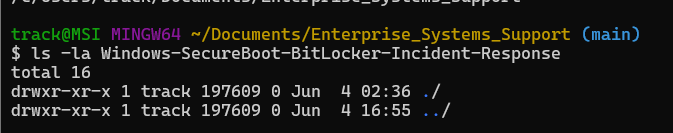
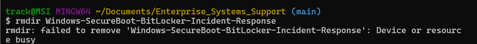
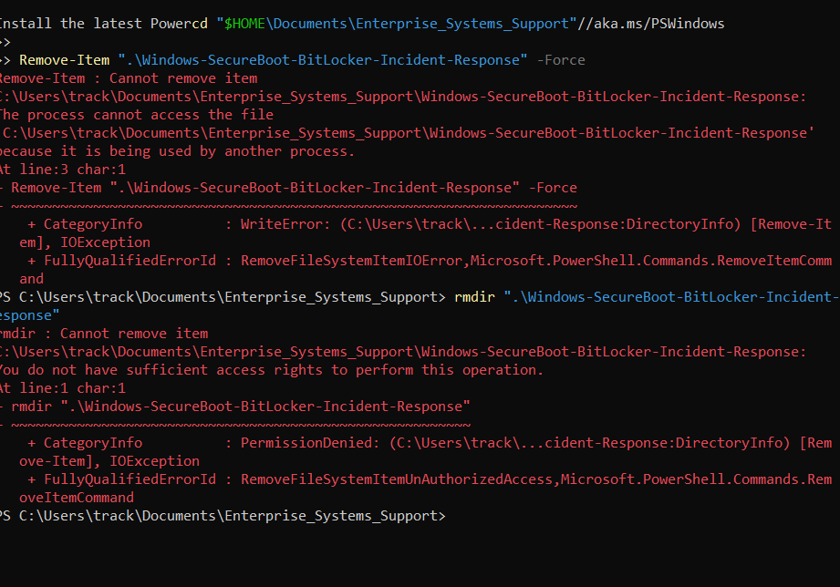
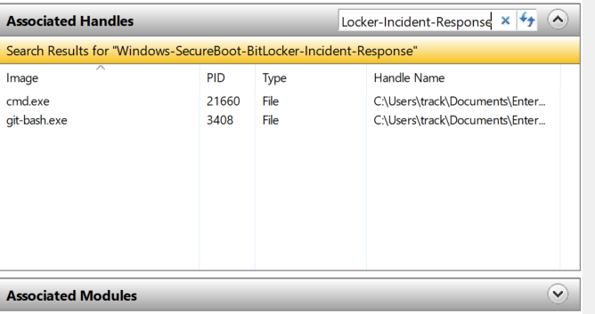
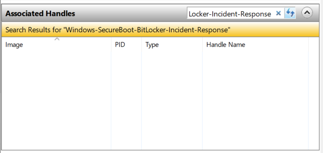
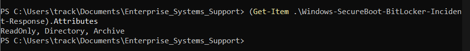
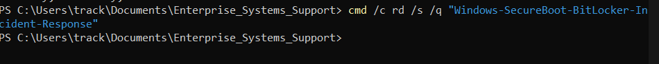
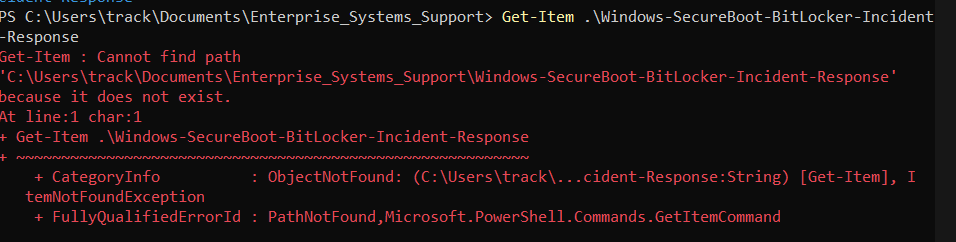
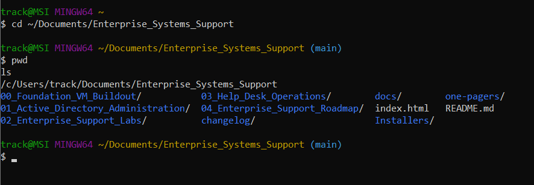

# LAB00 – Portfolio File System Troubleshooting

## Overview

This troubleshooting case study documents a real-world file system issue encountered during a major portfolio reorganization and repository cleanup effort.

While restructuring project folders and standardizing repository naming conventions, an empty legacy folder could not be removed despite appearing empty in File Explorer, Git Bash, and PowerShell.

The objective was to identify the cause, collect evidence, validate assumptions, and remove the directory using proper troubleshooting methodology.

---

## Technologies Used

- Windows 11
- Git Bash
- PowerShell
- Windows Resource Monitor
- Windows Command Prompt
- Git

---

## Business Scenario

During portfolio cleanup, a legacy project folder remained after restructuring the Enterprise Systems Support repository.

The folder appeared empty but resisted deletion through normal methods.

Multiple command-line tools produced different error messages, requiring systematic investigation to determine the root cause.

---

## Symptoms Observed

- Git Bash reported:

```text
Device or resource busy
```

- PowerShell reported:

```text
The process cannot access the file because it is being used by another process
```

- PowerShell later reported:

```text
Access denied
```

- Folder appeared empty in File Explorer
- Folder appeared empty using command-line inspection

---

## Investigation Process

### Step 1: Verify Folder Contents

Confirmed the directory was empty using Git Bash.

**Evidence:**



*Git Bash verification confirmed the directory appeared empty prior to deletion attempts.*

---

### Step 2: Attempt Standard Removal

Attempted deletion using Git Bash.

**Result:**

```text
Device or resource busy
```

**Evidence:**



*Initial deletion attempt failed with a "Device or resource busy" error.*

---

### Step 3: Attempt PowerShell Removal

Attempted deletion using PowerShell.

**Result:**

```text
The process cannot access the file because it is being used by another process
```

**Evidence:**



*PowerShell removal attempt generated an access-related error, indicating further investigation was required.*

---

### Step 4: Investigate Open Handles

Used Windows Resource Monitor to determine whether a process was actively holding the directory open.

Initial investigation identified active handles associated with command-line processes.

**Evidence:**



*Resource Monitor identified active handles associated with the target directory.*

---

### Step 5: Verify Handle Release

After closing associated processes, Resource Monitor confirmed that no handles remained attached to the directory.

**Evidence:**



*Verification confirmed that all handles had been released from the directory.*

---

### Step 6: Review Directory Attributes

Used PowerShell to inspect directory properties and attributes.

Observed:

```text
Read Only
Directory
Archive
```

**Evidence:**



*PowerShell attribute inspection confirmed the directory properties during troubleshooting.*

---

### Step 7: Use Native Windows Removal Command

Executed:

```cmd
cmd /c rd /s /q "Windows-SecureBoot-BitLocker-Incident-Response"
```

The command completed successfully.

**Evidence:**



*Native Windows directory removal command completed successfully.*

---

### Step 8: Validate Resolution

Confirmed the folder no longer existed.

**Evidence:**



*PowerShell verification confirmed the directory no longer existed.*



*Final repository validation confirmed successful cleanup and preservation of repository structure.*

------

## Skills Demonstrated

- Windows File System Troubleshooting
- Git Bash Administration
- PowerShell Investigation
- Resource Monitor Analysis
- Root Cause Analysis
- Process Handle Investigation
- Documentation and Evidence Collection
- Validation and Remediation Testing

---

## Lessons Learned

1. Empty folders can still be locked by active processes.
2. Resource Monitor is useful for identifying directory handles.
3. Git Bash, PowerShell, and native Windows commands may behave differently.
4. Verification is just as important as remediation.
5. Evidence-based troubleshooting prevents unnecessary assumptions.
## Findings and Root Cause Analysis

### Root Cause

The folder was not truly available for deletion despite appearing empty within File Explorer, Git Bash, and PowerShell.

Investigation using Windows Resource Monitor identified active process handles associated with the directory. These handles prevented normal deletion operations and generated inconsistent error messages across multiple administrative tools.

The issue was further complicated by differing behavior between Git Bash, PowerShell, and native Windows command-line utilities. While Git Bash reported a "Device or resource busy" error and PowerShell generated access-related errors, the native Windows directory removal utility successfully processed the deletion request.

### Contributing Factors

- Active process handles attached to the directory
- Inconsistent error reporting across administrative tools
- Directory appeared empty despite being actively referenced by the operating system
- Initial troubleshooting assumptions did not reveal the underlying handle dependency

### Resolution

After identifying and clearing active handles, the directory was removed using the native Windows removal command:

```cmd
cmd /c rd /s /q "Windows-SecureBoot-BitLocker-Incident-Response"
```

### Validation

The resolution was validated through multiple verification methods:

- Confirmed the directory no longer existed
- Verified PowerShell returned a "Path Not Found" result
- Confirmed repository integrity after cleanup
- Verified portfolio restructuring completed successfully without affecting other project files
---

