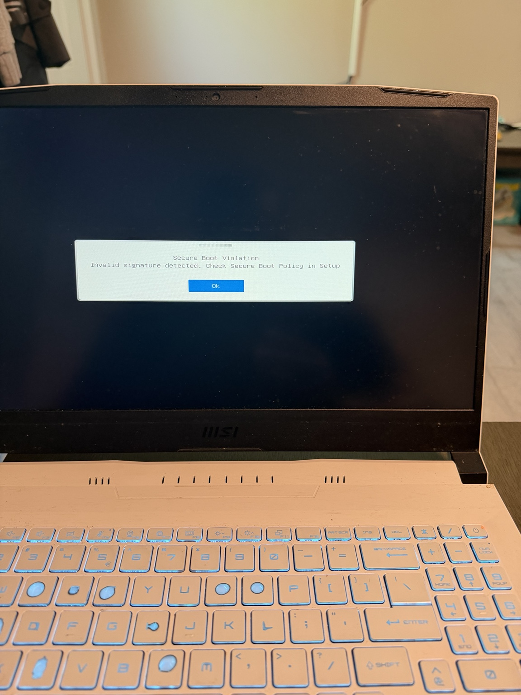
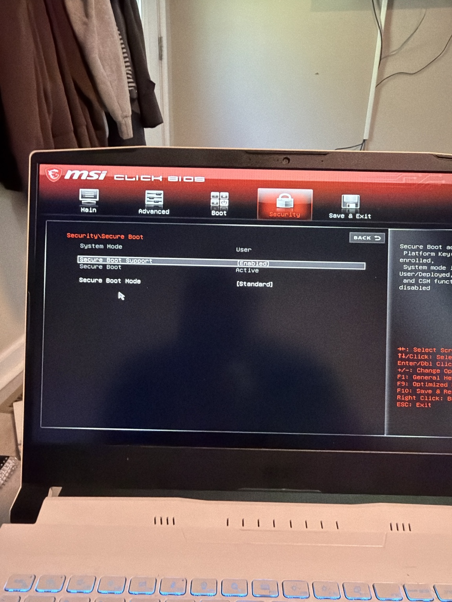
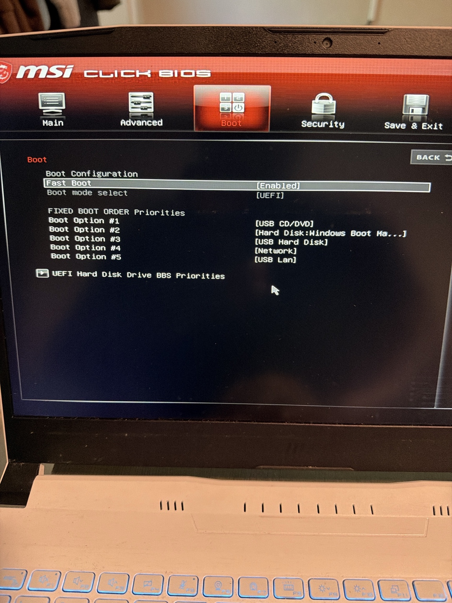
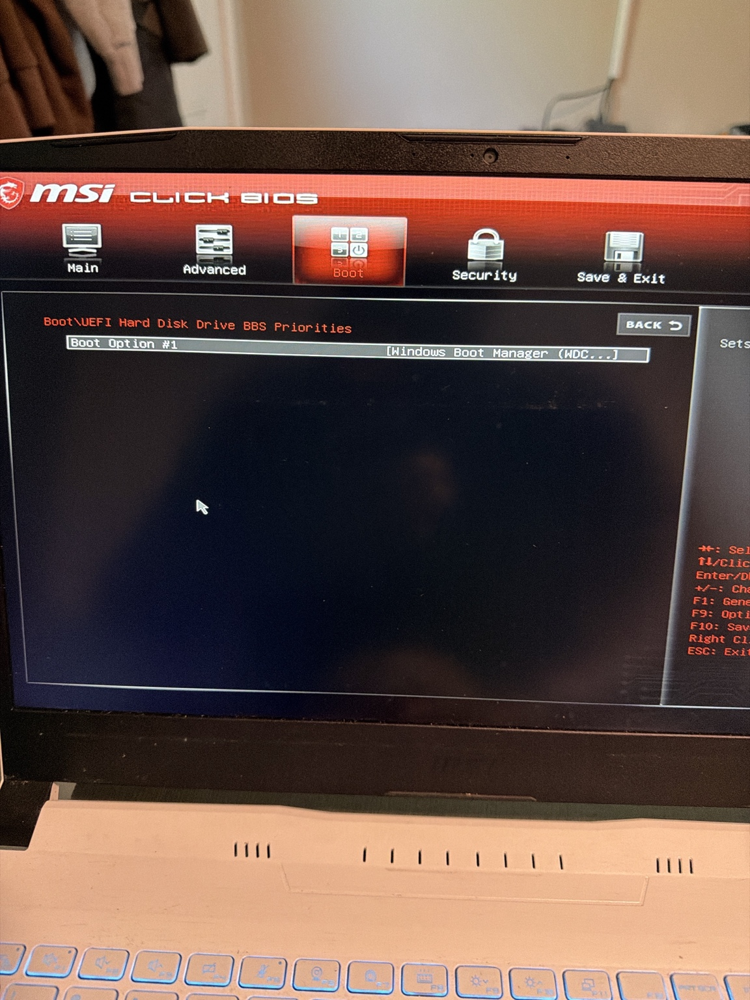
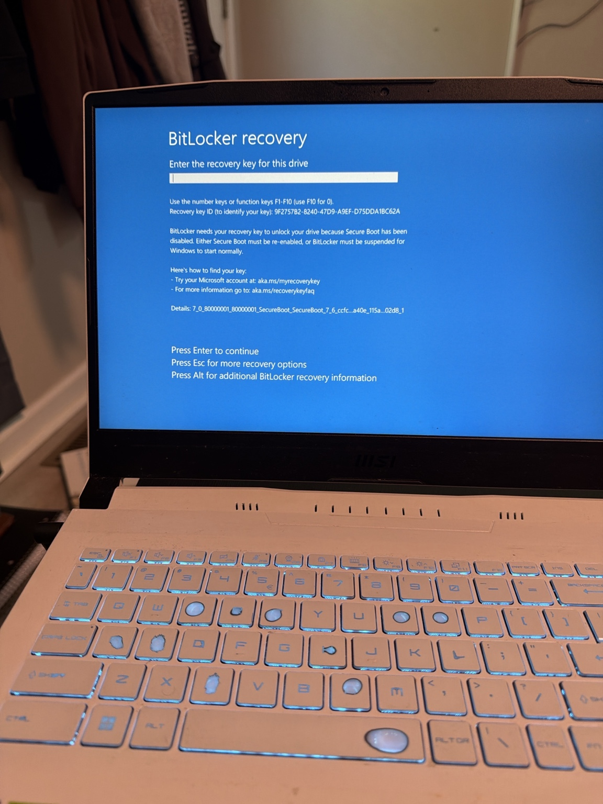
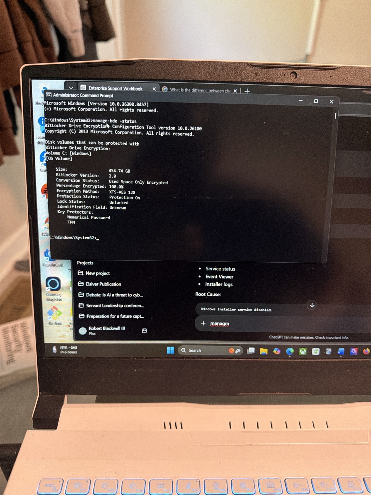
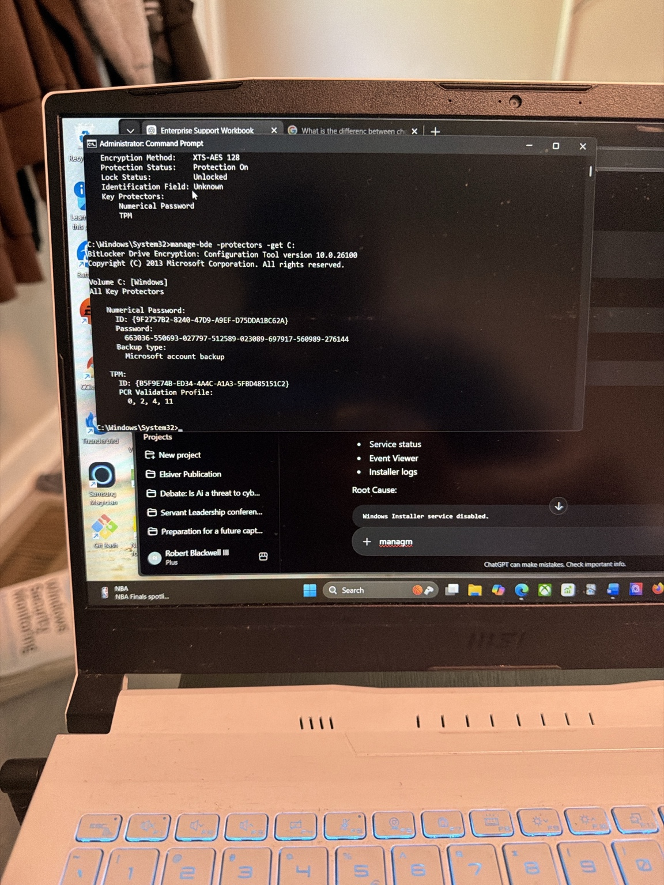
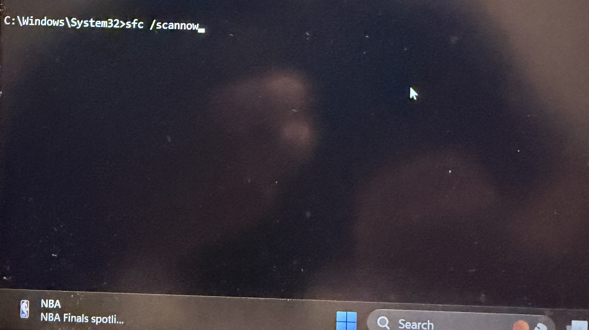
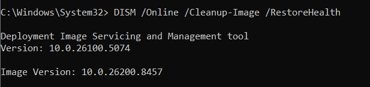

# LAB02 - Secure Boot & Bitlocker Incident Response


## Enterprise Systems Support Portfolio


## Executive Summary


This project documents a real-world Windows Secure Boot and BitLocker recovery incident that occurred on my MSI laptop after an unexpected battery failure during normal system operation.


Following the power loss, the system displayed a Secure Boot Violation error indicating an invalid boot signature. During the recovery process, BitLocker required a recovery key before Windows would allow access to the encrypted operating system volume.


The incident was investigated using BIOS/UEFI configuration review, BitLocker validation, Windows integrity checks, and recovery procedures. After successful recovery, system integrity was verified and BitLocker protection remained enabled.


---


## Skills Demonstrated


- Secure Boot Validation

- BitLocker Recovery

- TPM Verification

- BIOS/UEFI Troubleshooting

- Windows Security Administration

- SFC Integrity Validation

- DISM Component Store Repair

- Incident Documentation

- Root Cause Analysis

- Command-Line Administration


---


## Environment


### Hardware


- MSI Laptop

- UEFI Firmware

- TPM Enabled

- Internal SSD


### Operating System


- Windows 11


### Security Technologies


- Secure Boot

- TPM

- BitLocker Drive Encryption

- Windows Defender


---


## Incident Description

### Initial Symptoms

Following an unexpected battery shutdown, the system failed to boot normally and displayed:

> Secure Boot Violation
> Invalid signature detected. Check Secure Boot Policy in Setup.

After Secure Boot configuration review, the system proceeded to a BitLocker recovery screen requiring a recovery key before the operating system could load.

### Evidence



*Secure Boot violation displayed during startup following the unexpected shutdown.*

---

## Investigation Timeline

### Phase 1 – Secure Boot Validation

Observed Secure Boot error during startup.

#### Evidence



*Secure Boot settings reviewed and confirmed enabled within BIOS.*

---

### Phase 2 – BIOS and UEFI Review

Verified:

* Secure Boot Enabled
* Secure Boot Active
* Secure Boot Mode = Standard
* UEFI Boot Mode Enabled
* Windows Boot Manager Present

#### Evidence



*BIOS boot configuration reviewed during troubleshooting.*



*UEFI boot priorities validated to ensure proper boot sequence.*

---

### Phase 3 – BitLocker Recovery

System requested a BitLocker recovery key.

Recovery key was retrieved from the Microsoft Account backup and successfully entered.

Windows booted normally.

#### Evidence



*BitLocker recovery prompt displayed after Secure Boot validation.*

---

### Phase 4 – BitLocker Validation

Verified encryption status using:

```powershell
manage-bde -status
```

Results confirmed:

* Encryption Active
* Protection On
* TPM Present
* Volume Encrypted
* Drive Successfully Unlocked

#### Evidence



*BitLocker encryption status validated after system recovery.*

---

### Phase 5 – BitLocker Protector Verification

Verified recovery protectors using:

```powershell
manage-bde -protectors -get C:
```

Confirmed:

* TPM Protector Present
* Recovery Password Present
* Recovery Key Backed Up to Microsoft Account

#### Evidence



*BitLocker recovery protector configuration validated.*

---

### Phase 6 – Windows Integrity Verification

Executed:

```powershell
sfc /scannow
```

Result:

> Windows Resource Protection did not find any integrity violations.

#### Evidence



*System File Checker completed successfully with no integrity violations detected.*

---

### Phase 7 – Component Store Verification

Executed:

```powershell
DISM /Online /Cleanup-Image /RestoreHealth
```

Result:

> The restore operation completed successfully.

#### Evidence



*DISM validation confirmed Windows component store health and recovery readiness.*

---


```


Result:


> The restore operation completed successfully.


#### Evidence


- Screenshot 09 – DISM Component Store Validation


---


## Root Cause Analysis


### Most Probable Cause


Unexpected power loss during shutdown or boot validation caused Secure Boot and TPM measurements to change sufficiently to trigger BitLocker recovery.


No evidence was found indicating:


- Malware

- Bootkit Activity

- Disk Corruption

- File System Corruption

- Operating System Damage


System integrity checks completed successfully.


---


## Commands Executed


### BitLocker Status Verification


```powershell

manage-bde -status

```


### BitLocker Protector Verification


```powershell

manage-bde -protectors -get C:

```


### System File Verification


```powershell

sfc /scannow

```


### Component Store Verification


```powershell

DISM /Online /Cleanup-Image /RestoreHealth

```


---


## Resolution


The system was successfully recovered using the BitLocker recovery key stored in the associated Microsoft account.


Secure Boot remained enabled, BitLocker encryption remained active, TPM validation succeeded, and Windows integrity checks confirmed no corruption was present.


The system returned to normal operation without requiring reinstallation or data recovery procedures.


---


## Lessons Learned


1\. Secure Boot and BitLocker work together to protect system integrity.

2\. Unexpected power events can trigger BitLocker recovery.

3\. Recovery keys should always be backed up and accessible.

4\. TPM measurements directly impact BitLocker trust decisions.

5\. Windows integrity verification should be performed after recovery events.


---


## Portfolio Reflection


This incident reinforced the importance of understanding how modern Windows security technologies work together. Prior to this event, Secure Boot and BitLocker were concepts I had studied. During this incident, I was required to troubleshoot them in a real-world scenario.


The experience demonstrated how TPM measurements, Secure Boot validation, and BitLocker encryption interact to protect system integrity. It also reinforced the importance of maintaining recovery keys and validating system health after a recovery event.


Most importantly, this project showed that effective troubleshooting requires more than simply restoring functionality. It requires validating security controls, confirming system integrity, documenting findings, and identifying root cause before returning a system to production use.


---


## Incident Summary (STAR Format)


### Situation


A Windows laptop experienced an unexpected battery shutdown and subsequently displayed a Secure Boot violation followed by a BitLocker recovery prompt.


### Task


Determine whether the issue represented corruption, security compromise, or a normal security protection event.


### Action


Reviewed BIOS configuration, validated Secure Boot, recovered the system using the BitLocker recovery key, verified BitLocker protectors, and executed SFC and DISM integrity checks.


### Result


System recovered successfully, encryption remained enabled, no corruption was found, and normal operation was restored.


