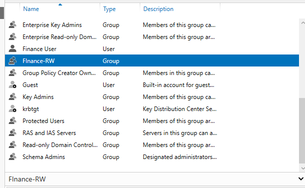
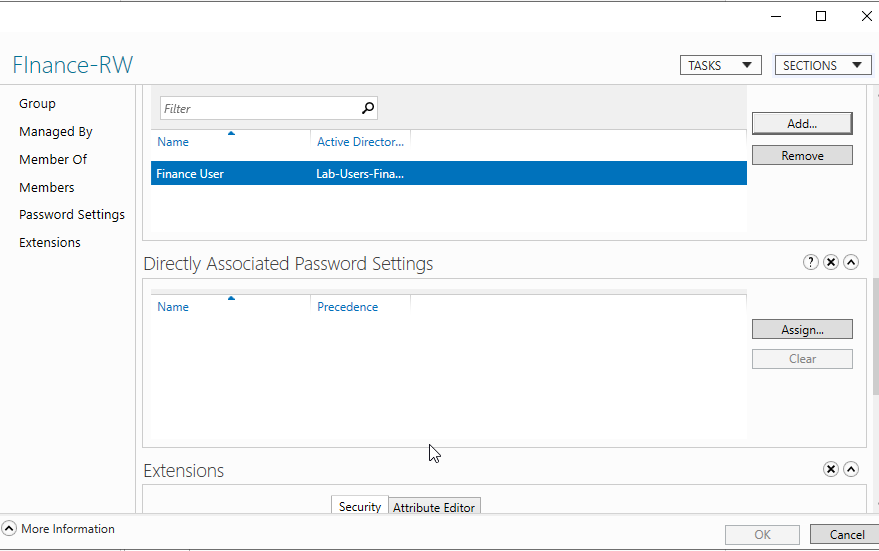
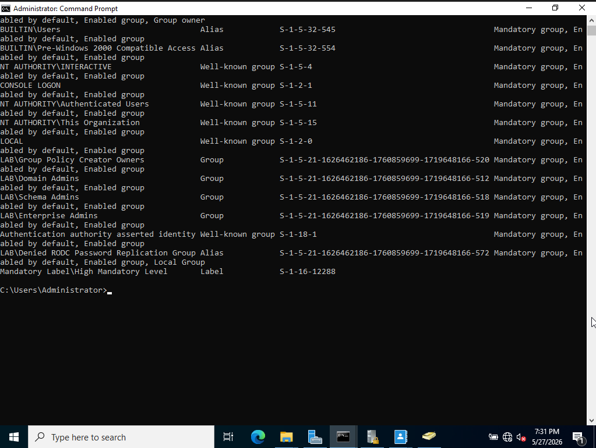
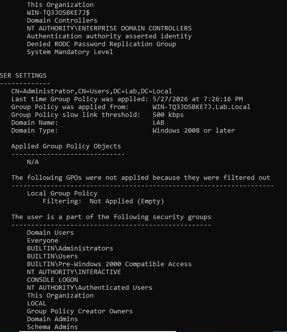
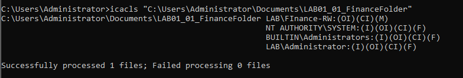
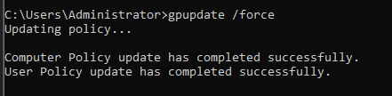
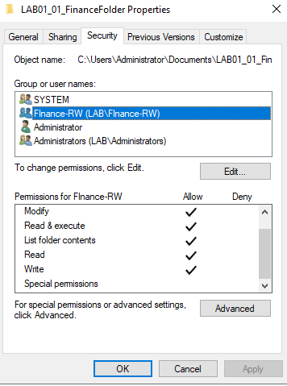
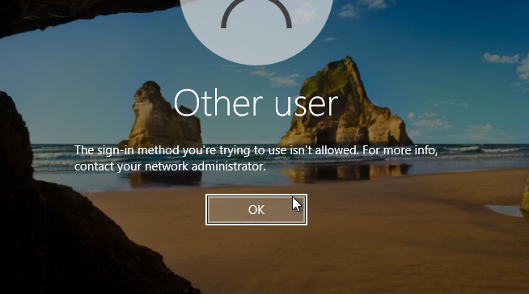

# LAB 01 · Windows User Account & Permissions Troubleshooting

## Overview

This lab simulates a common enterprise support scenario involving user access failures caused by incorrect Active Directory group membership and NTFS permissions.

The objective was to diagnose why a finance user could not access a department resource and restore appropriate access while documenting the troubleshooting process.

---

## Skills Demonstrated

* Active Directory User Management
* Active Directory Security Groups
* NTFS Permissions
* Group Membership Validation
* Command Line Troubleshooting
* Group Policy Validation
* Event Viewer Analysis
* Root Cause Analysis
* Ticket Documentation

---

## Technologies Used

* Windows Server
* Active Directory Users and Computers
* Group Policy
* Event Viewer
* Command Prompt
* whoami
* gpresult
* icacls

---

## Business Scenario

A finance employee reports receiving an Access Denied error when attempting to access department resources following a role change.

The objective is to determine whether the issue is related to:

* User account configuration
* Group membership
* NTFS permissions
* Group Policy
* Authentication

---

## Evidence Collected

See screenshots folder for validation evidence.

---

## Root Cause

The user account was not properly associated with the Finance-RW security group required for access to the Finance department folder.

---

## Resolution

* Verified user account creation
* Created Finance-RW security group
* Added Finance User to Finance-RW
* Assigned Modify permissions to Finance-RW
* Validated group membership
* Validated ACL configuration
* Reviewed Group Policy application
* Reviewed security logs
* Confirmed successful remediation

---

## Lessons Learned

This lab reinforced the importance of validating group membership before assuming file permission corruption or system failure.

In enterprise environments, user access issues are frequently caused by identity and authorization problems rather than technical failures.

## Evidence Collection

### Active Directory User Creation

### Finance-RW Security Group

### Group Membership Validation

### NTFS Modify Permissions Assigned

### Security Token Analysis

### GPResult Computer Policy Validation

### GPResult User Policy Validation

### ICACLS ACL Verification

### Group Policy Update Validation

### Event Viewer Security Log Review

### Final Access Validation

### Domain Controller Logon Restriction Analysis

