# Lab 01 – DHCP Deployment and APIPA Troubleshooting

## Lab Outcomes

Installed and configured Windows Server DHCP

Created and activated a DHCP scope

Configured DNS integration

Migrated a workstation from static addressing to DHCP

Simulated DHCP failure and APIPA assignment

Restored DHCP services and validated lease assignment

## Scenario

A workstation in the Lab.Local Active Directory environment experienced network connectivity issues and originally received an APIPA address. The goal of this lab was to investigate the issue, deploy DHCP on the Domain Controller, configure a DHCP scope, and validate dynamic IP address assignment.

## Skills Demonstrated

- Windows Server 2022 DHCP role installation
- DHCP scope creation
- DHCP lease validation
- DNS option configuration
- APIPA troubleshooting
- Static-to-DHCP client migration
- `ipconfig`, `ipconfig /release`, and `ipconfig /renew`
- Client/server network validation
- Root cause analysis

## Lab Summary

The client workstation was initially configured with a static IP address after an earlier APIPA issue. During troubleshooting, I confirmed that DHCP was not being provided by the Domain Controller. I installed and configured the DHCP Server role, created a DHCP scope for the 192.168.10.0/24 network, configured DNS options, and validated that the client received a DHCP lease from the Domain Controller.

## Network Configuration

| Device | Role | IP Address |
|---|---|---|
| Server 2022 | Domain Controller / DNS / DHCP | 192.168.10.10 |
| Windows Client | Domain-Joined Workstation | 192.168.10.100 |
| DHCP Scope | Workstation Address Pool | 192.168.10.100 - 192.168.10.200 |

## Screenshots

# Screenshot Evidence

## Screenshot 01 – Initial IP Configuration

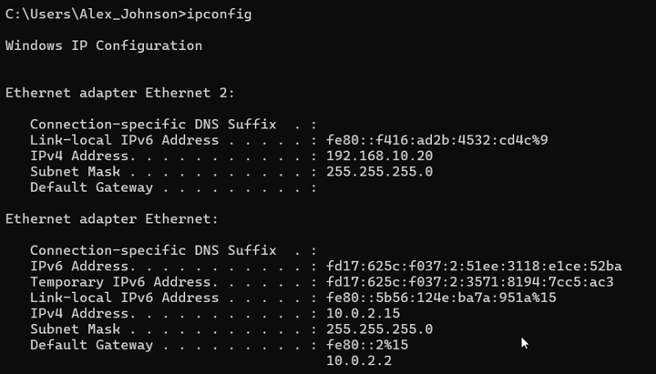

Shows the workstation's initial network configuration before troubleshooting.

---

## Screenshot 02 – Detailed Adapter Information

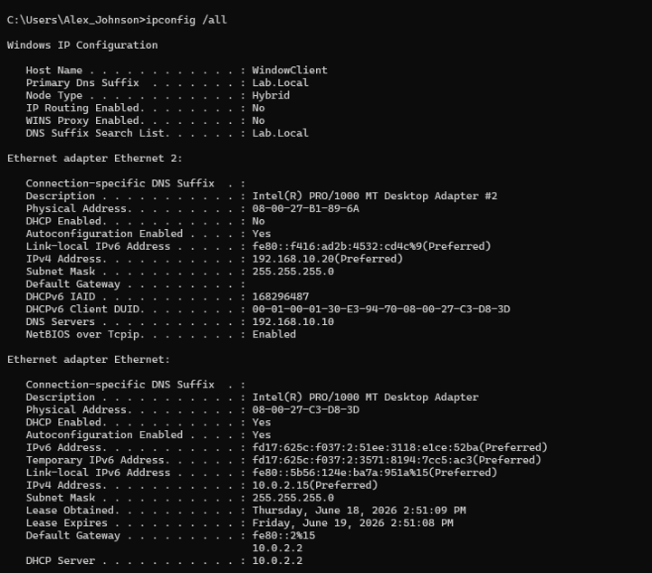

Displays detailed adapter information including DNS, DHCP, MAC address, and lease information.

---

## Screenshot 03 – Release DHCP Lease

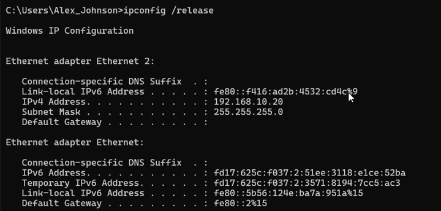

Demonstrates releasing the current IP address assignment.

---

## Screenshot 04 – Renew DHCP Lease

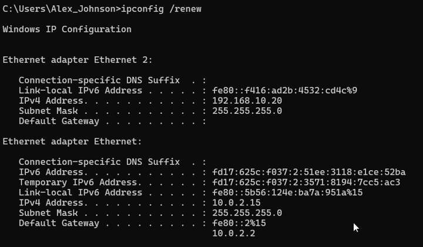

Demonstrates requesting a new DHCP lease from the DHCP server.

---

## Screenshot 05 – Connectivity Validation

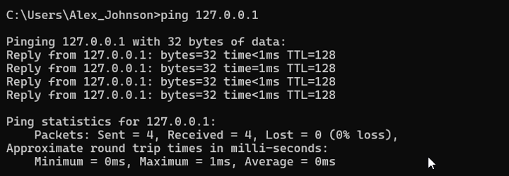

Validates TCP/IP functionality, local connectivity, Domain Controller connectivity, internet access, and DNS resolution.

---

## Screenshot 06 – Network Adapter Disabled

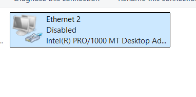

Simulates loss of connectivity to the enterprise network.

---

## Screenshot 07 – APIPA Address Assignment

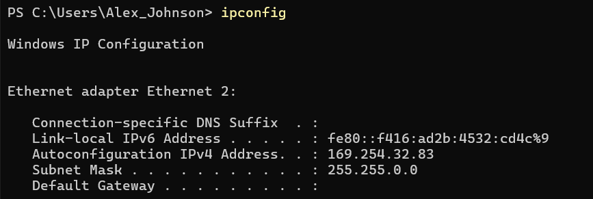

Shows APIPA addressing after DHCP services became unavailable.

---

## Screenshot 08 – DHCP Scope Created

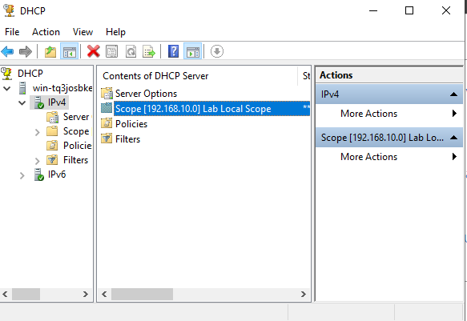

Demonstrates successful creation and activation of the DHCP scope.

---

## Screenshot 09 – DHCP Address Pool

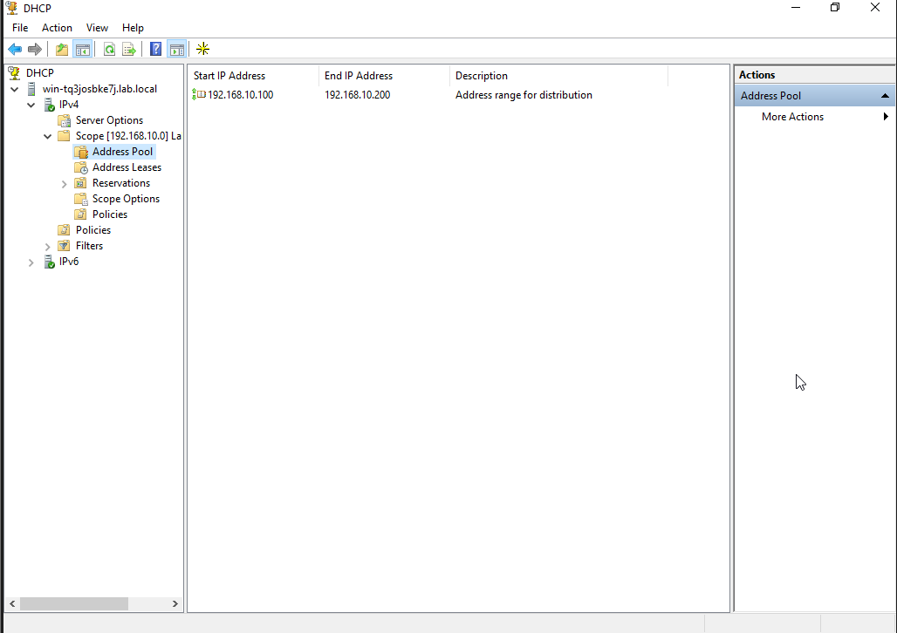

Displays the configured DHCP address pool for client workstations.

---

## Screenshot 10 – DHCP Scope Options

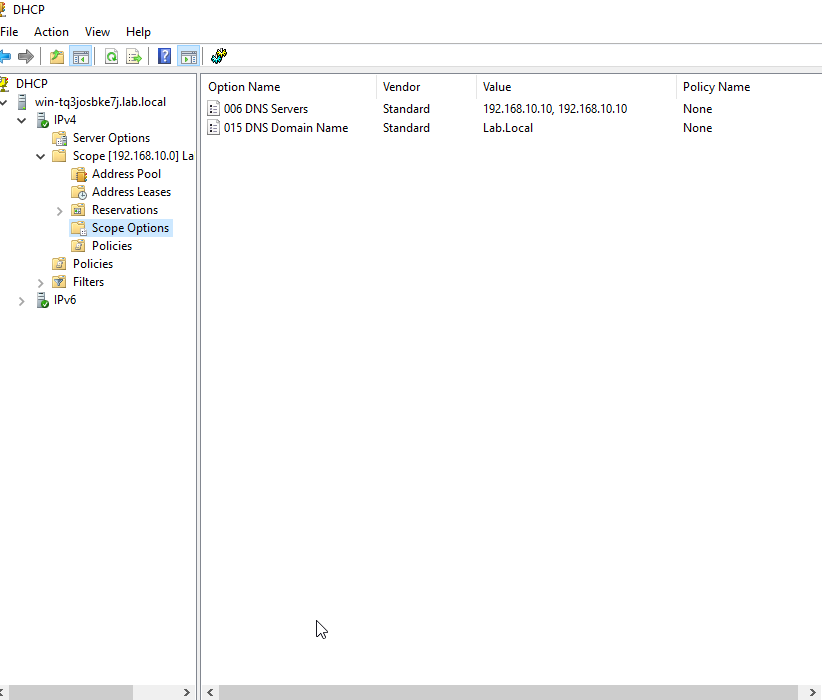

Shows DNS server and domain options configured within DHCP.

---

## Screenshot 11 – DHCP Address Lease

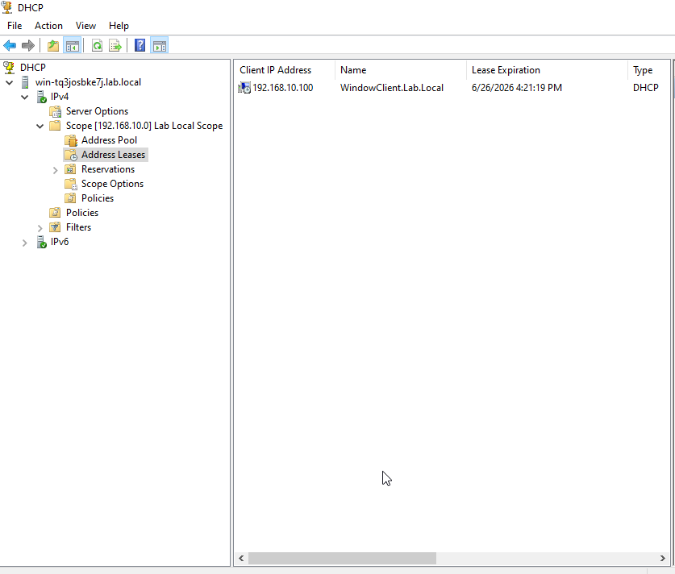

Validates successful lease assignment to the domain-joined workstation.
## Root Cause Analysis

The original issue was caused by the lack of a DHCP service on the Active Directory lab network. The workstation could not automatically receive a valid IP address and fell back to APIPA addressing. A temporary static IP address restored connectivity, but the underlying issue required DHCP deployment.

## Resolution

The DHCP Server role was installed and authorized on the Domain Controller. A scope was created for the 192.168.10.0/24 network, with available addresses from 192.168.10.100 through 192.168.10.200. DNS options were configured so clients would use the Domain Controller for name resolution.

## Validation

After switching the client adapter from static addressing to automatic addressing, the workstation successfully received 192.168.10.100 from DHCP server 192.168.10.10. The DHCP console confirmed the active lease for WindowClient.Lab.Local.

## Lessons Learned

- APIPA usually indicates that a client cannot reach a DHCP server.
- Static IP addressing can be useful as a temporary troubleshooting workaround.
- DHCP must be authorized and scoped before clients can receive leases.
- DNS and DHCP are closely connected in Active Directory environments.
- DHCP lease tables help verify that clients are receiving addresses correctly.
