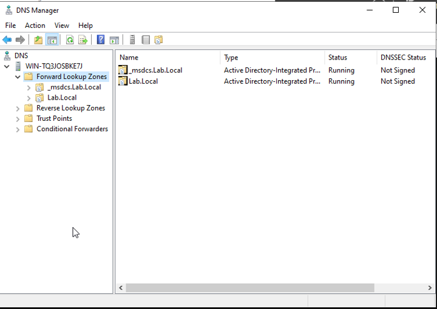
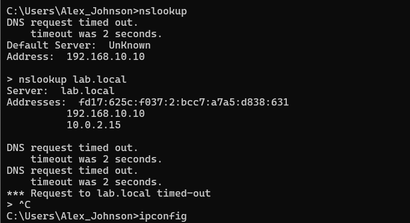
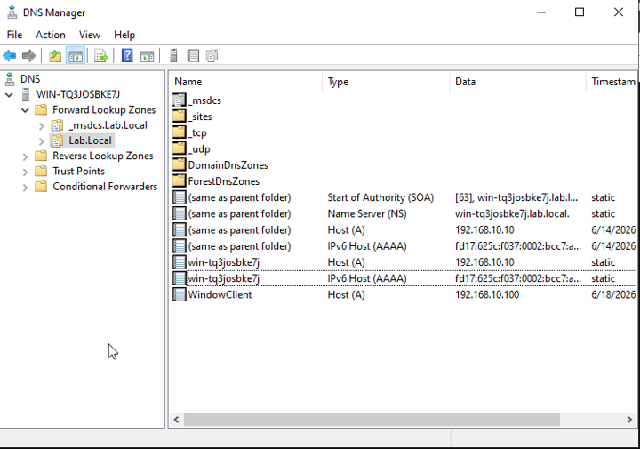

# DNS Troubleshooting and Dual-Homed Active Directory DNS Remediation

## Lab Overview

This lab focused on troubleshooting DNS issues within a Windows Active Directory environment. During validation testing, an unexpected DNS resolution problem was discovered. Initial symptoms suggested a standard DNS failure; however, further investigation revealed a more complex issue involving duplicate DNS registrations caused by a dual-homed Domain Controller.

The objective of this lab evolved from basic DNS validation into a real-world troubleshooting exercise involving root cause analysis, DNS record remediation, validation testing, and technical documentation.

---

## Environment

### Domain Controller

* Windows Server 2022
* Active Directory Domain Services (AD DS)
* DNS Server
* DHCP Server
* Domain: Lab.Local
* IP Address: 192.168.10.10

### Client Workstation

* Windows Client
* Domain Joined
* DHCP Assigned Address

---

## Learning Objectives

* Understand the role of DNS in Active Directory environments.
* Validate hostname resolution using DNS tools.
* Review common DNS record types.
* Investigate DNS resolution failures.
* Perform root cause analysis.
* Correct DNS configuration issues.
* Validate service restoration.
* Develop a structured troubleshooting methodology.

---

## DNS Fundamentals

DNS (Domain Name System) translates human-readable hostnames into IP addresses used by devices for communication.

Examples include:

* fileserver.lab.local
* dc01.lab.local
* intranet.company.local

Without DNS, users would need to remember numerical IP addresses instead of meaningful hostnames.

Because Active Directory relies heavily on DNS, even a minor DNS issue can affect authentication, resource access, Group Policy processing, and other core enterprise services.

---

## DNS Records Investigated

### A Record

Maps a hostname to an IPv4 address.

### AAAA Record

Maps a hostname to an IPv6 address.

### CNAME Record

Creates an alias that points one hostname to another hostname.

### PTR Record

Supports reverse DNS lookups by mapping IP addresses back to hostnames.

---

## Troubleshooting Methodology

### Reported Problem

A user reports:

> "I can access resources by IP address, but I cannot access them by hostname."

### Investigation Process

1. Verified network connectivity.
2. Reviewed IP configuration.
3. Verified DNS server configuration.
4. Tested hostname resolution using nslookup.
5. Reviewed DNS Manager.
6. Examined Forward Lookup Zones.
7. Reviewed Host (A) records.
8. Identified duplicate DNS registrations.
9. Removed incorrect DNS records.
10. Validated successful name resolution.

---

## Root Cause Analysis

### Problem Observed

During validation testing, DNS queries intermittently timed out when attempting to resolve Lab.Local.

Although network connectivity remained functional, hostname resolution was unreliable.

### Investigation

The following validation steps were performed:

* Verified DHCP lease assignment.
* Verified client DNS configuration.
* Verified network connectivity.
* Reviewed DNS Manager.
* Examined Forward Lookup Zones.
* Examined Host (A) records.

### Root Cause

Investigation revealed that the Domain Controller was operating as a dual-homed system and had registered both of the following addresses within Active Directory DNS:

* 192.168.10.10
* 10.0.2.15

The second address belonged to the VirtualBox NAT network.

As a result, DNS queries could return multiple addresses for the same host, creating inconsistent hostname resolution behavior and intermittent DNS request timeouts.

### Corrective Action

DNS Manager was used to identify duplicate Host (A) records associated with the VirtualBox NAT interface.

The incorrect DNS records referencing:

* 10.0.2.15

were removed from the Lab.Local DNS zone.

### Validation

Following remediation:

* DNS cache was flushed.
* nslookup testing was repeated.
* Hostname resolution was successfully restored.
* Network connectivity was validated.
* DNS responses returned the correct address.

---

## Key Findings

One of the most important lessons from this lab was learning that DNS failures are not always caused by the DNS service itself.

Although the DNS service remained operational, duplicate DNS registrations created by a dual-homed Domain Controller resulted in inconsistent hostname resolution.

This reinforced the importance of investigating DNS records, network configuration, and system architecture rather than immediately assuming a DNS server failure.

---

## Lessons Learned

* DNS failures do not always originate from the DNS service itself.
* Successful ping tests do not automatically confirm DNS health.
* Dual-homed systems can create duplicate DNS registrations.
* Active Directory environments rely heavily on accurate DNS records.
* Root cause analysis should be completed before escalation.
* Proper documentation is a critical enterprise support skill.
* DNS Manager is an essential troubleshooting tool for Windows administrators.

---

## Why This Matters

DNS is one of the most critical services in an Active Directory environment.

A user may have full network connectivity and still be unable to access websites, printers, file shares, applications, or domain resources if DNS is not functioning properly.

This lab demonstrated how a seemingly simple DNS issue can actually be caused by infrastructure configuration problems rather than a failed service.

Understanding DNS troubleshooting is a foundational skill for:

* Help Desk Technicians
* Desktop Support Specialists
* School District IT Staff
* Systems Administrators
* Infrastructure Support Technicians

---

## Validation Checklist

* DNS server configuration validated
* DNS records reviewed
* Forward Lookup Zones examined
* Root cause identified
* Duplicate DNS records removed
* DNS cache flushed
* Hostname resolution restored
* Active Directory functionality verified

---

## Screenshots

### DNS Zone Structure

### Root Cause Discovery

### Corrected DNS Records

### Post-Remediation Validation

---

## Related Research

### SIGRed (CVE-2020-1350)

This lab includes additional research into SIGRed (CVE-2020-1350), a critical Windows DNS Server Remote Code Execution vulnerability that demonstrates the importance of securing DNS infrastructure within enterprise environments.

See:

[Research/SIGRed_CVE_2020_1350.md](Research/SIGRed_CVE_2020_1350.md)

---

## Professional Skills Demonstrated

* DNS Administration
* Active Directory Fundamentals
* Active Directory DNS Troubleshooting
* DNS Record Management
* Network Troubleshooting
* Root Cause Analysis
* Validation Testing
* Technical Documentation
* Incident Resolution
* Enterprise Support Methodology
* Windows Server Administration
* Dual-Homed Network Analysis
