## ## Current Lab Status

## ### Status: Knowledge Phase Complete

## The conceptual and troubleshooting portions of this lab have been completed, including:

## - Static IPv4 addressing

## - DHCP versus Static IP research

## - Subnetting fundamentals

## - Default gateway behavior

## - DNS validation methodology

## - Connectivity testing procedures

## - Root cause analysis documentation

## ### Lab Findings

## During testing, an intentionally incorrect subnet mask was applied to the client workstation.

## Configuration:

 

## - IP Address: 192.168.10.100

## - Incorrect Subnet Mask: 255.255.255.240

 

## Observed Results:

 

## - Hostname resolution failed

## - DNS queries timed out

## - nslookup failed

## - ping lab.local failed

 

## The incorrect subnet mask caused the workstation to calculate network boundaries incorrectly, preventing normal communication with DNS services.

## Screenshots

### 01 – DHCP Baseline Configuration

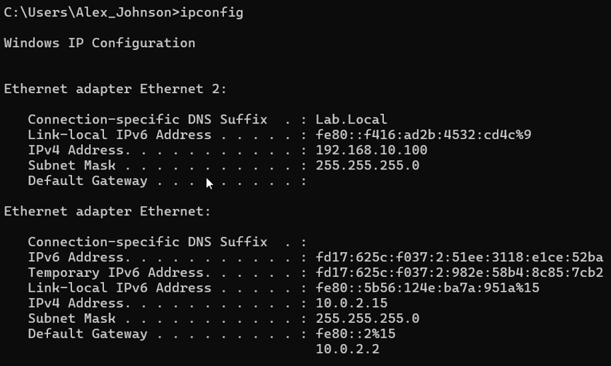

---

### 02 – Detailed DHCP Configuration

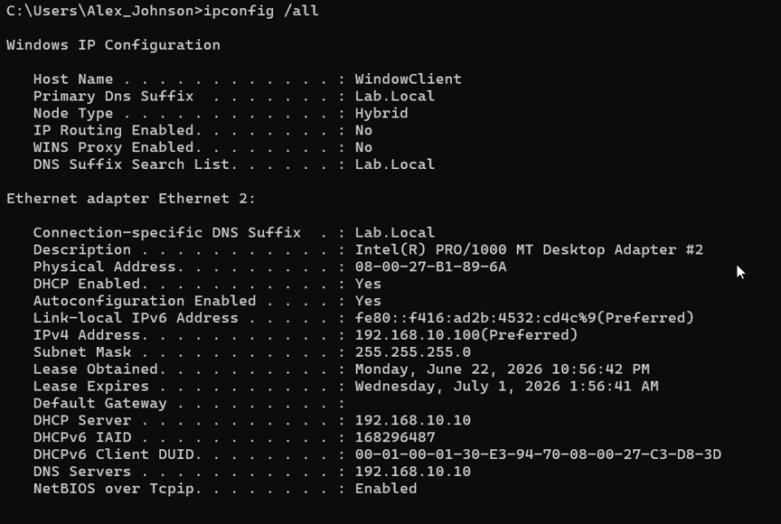

---

### 03 – Static IP Configuration

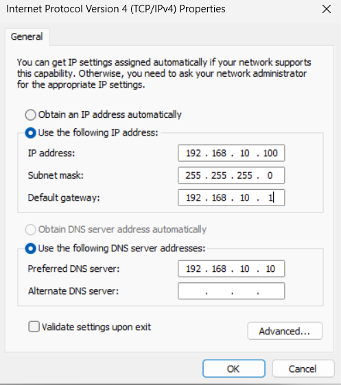

---

### 04 – Static IP Validation

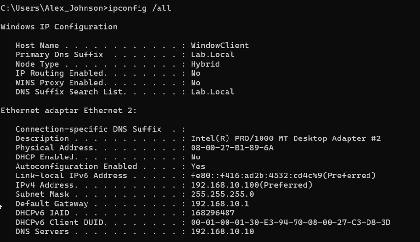

---

### 05 – Connectivity Test by IP Address

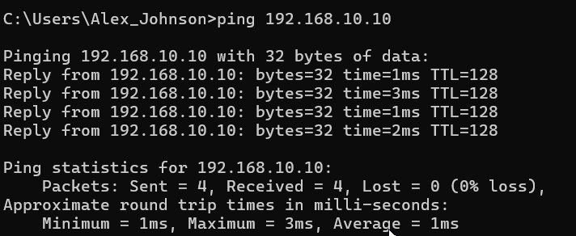

---

### 06 – DNS Resolution Validation

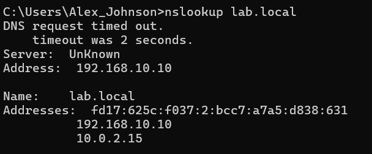

---

### 07 – Hostname Connectivity Validation

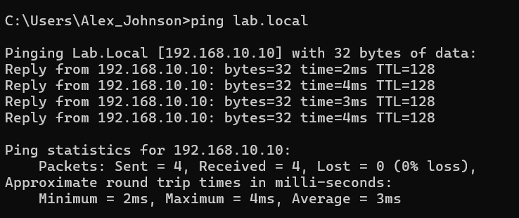

---

### 08 – Incorrect Subnet Mask Configuration

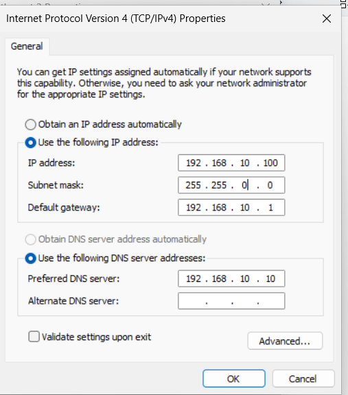

---

### 09 – DNS Failure Caused by Incorrect Subnet Mask

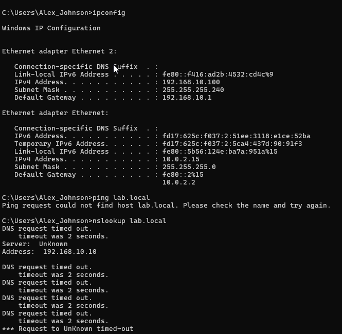

---

### 10 – Incorrect Gateway Configuration

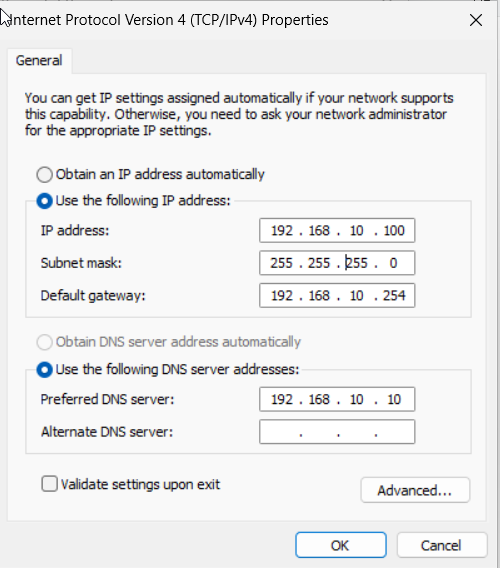

---

### 11 – Connectivity Results with Incorrect Gateway

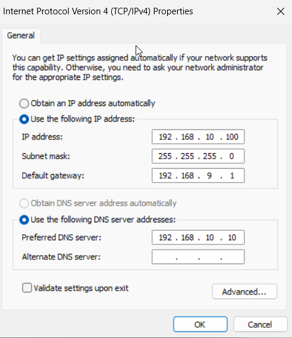

---

### 12 – Final Validation After Remediation

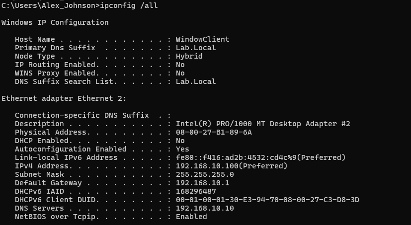

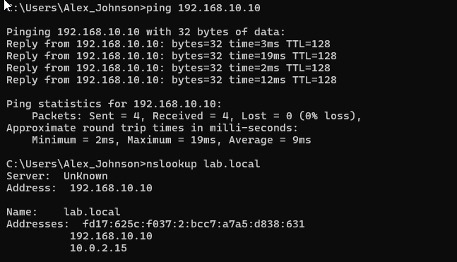

### Root Cause Analysis

| Section | Findings |
|----------|----------|
| Problem Observed | User reported loss of access to network resources |
| Investigation Performed | Reviewed IP configuration, subnet mask, gateway, DNS settings, and tested connectivity using ping and nslookup |
| Root Cause | Incorrect subnet mask and invalid gateway configuration caused network communication failures |
| Corrective Action | Restored proper subnet mask, gateway, and DNS settings |
| Validation | Verified functionality using ipconfig /all, ping 192.168.10.10, ping lab.local, and nslookup lab.local |

### Lessons Learned

This lab reinforced the importance of ensuring that IP addressing, subnet masks, DNS settings, and gateway configurations align with the network design. Incorrect network settings can disrupt domain communication, prevent DNS resolution, and cause connectivity issues throughout an enterprise environment.
## This lab reinforced the importance of ensuring that IP addressing, subnet masks, DNS settings, and gateway configurations align with the network design. Incorrect network settings can disrupt domain communication, prevent DNS resolution, and cause connectivity issues throughout an enterprise environment.

### Remaining Tasks

- [x] Capture final screenshots
- [ ] Complete PrintNightmare case study
- [x] Embed screenshots into README
- [x] Remove screenshots/PLACEHOLDER.md

