# VLAN Segmentation Lab

## Enterprise Systems Support Portfolio

## Executive Summary

This lab demonstrates VLAN segmentation across a multi-switch environment using Cisco Packet Tracer.

The purpose of this lab was to show how switches can separate devices into logical network groups even when those devices share the same physical infrastructure. The lab began with all endpoints in the default VLAN where every PC could communicate. After VLANs were created and access ports were assigned, communication became restricted based on VLAN membership. Trunking was then configured to carry VLAN traffic between switches.

The main lesson from this lab is that segmentation controls communication. VLANs are not just an organizational tool; they are used in enterprise environments to improve security, reduce broadcast traffic, support scalability, and limit lateral movement.

---

## Business Problem

In a flat network, all devices can communicate freely. This increases security risk, creates unnecessary broadcast traffic, and makes it harder to separate users, departments, guests, servers, or sensitive systems.

Enterprise networks use VLANs to logically separate traffic without needing completely separate physical hardware.

Examples include:

- HR VLAN
- Finance VLAN
- Guest Wireless VLAN
- Server VLAN
- Security Camera VLAN
- Voice VLAN

---

## Lab Objectives

- Build a multi-switch topology
- Assign static IP addresses to endpoints
- Verify default VLAN behavior
- Create VLAN 20 and VLAN 30
- Assign switch access ports to VLANs
- Verify VLAN membership
- Prove communication failure after segmentation
- Configure 802.1Q trunking
- Restore same-VLAN communication across switches
- Validate that different VLANs remain isolated

---

## Environment and Topology

| Device | Connected To | Port | IP Address |
|---|---|---|---|
| PC0 | Switch0 | Fa0/1 | 172.16.1.2 /24 |
| PC2 | Switch0 | Fa0/2 | 172.16.1.4 /24 |
| PC1 | Switch1 | Fa0/1 | 172.16.1.3 /24 |
| PC3 | Switch1 | Fa0/2 | 172.16.1.5 /24 |
| Switch0 | Switch1 | Gi0/1 to Gi0/1 | N/A |

VLAN placement:

- VLAN 20: PC0 and PC1
- VLAN 30: PC2 and PC3

---

## Technologies Used

- Cisco Packet Tracer
- Cisco Catalyst 2960 Switches
- Cisco IOS CLI
- VLAN Segmentation
- Access Ports
- 802.1Q Trunking
- Static IP Addressing
- ICMP Ping Testing
- Layer 2 Switching

---

## Configuration Summary

### Default State

The lab began with all switch ports in VLAN 1. At this stage, all four PCs were able to communicate because they were in the same broadcast domain.

### VLAN Creation

VLAN 20 and VLAN 30 were created on both switches.

### Access Port Assignment

Switch access ports were assigned as follows:

- Fa0/1 assigned to VLAN 20
- Fa0/2 assigned to VLAN 30

### Trunk Configuration

GigabitEthernet0/1 was configured as a trunk link to carry VLAN traffic between Switch0 and Switch1.

---

## Validation and Testing

Testing was performed in phases.

### Phase 1: Baseline Connectivity

Before VLAN segmentation, all PCs could successfully ping each other.

### Phase 2: Segmentation Validation

After assigning access ports to VLAN 20 and VLAN 30, communication became restricted. Devices in different VLANs could not communicate.

### Phase 3: Pre-Trunk Failure

Devices in the same VLAN but connected to different switches could not communicate until trunking was configured.

### Phase 4: Post-Trunk Success

After configuring the 802.1Q trunk, devices in the same VLAN across different switches could communicate.

## Guided Technical Walkthrough

### Step 1 – Build the Network Topology

The lab environment consisted of two Cisco Catalyst 2960 switches connected through a Gigabit Ethernet link and four endpoint devices.

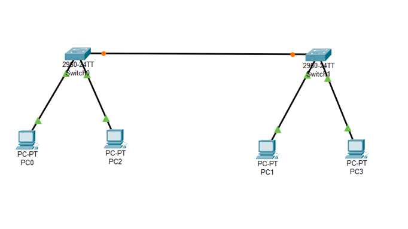

Purpose:

To simulate a small enterprise network where users are connected through multiple access switches.

---

### Step 2 – Configure Endpoint IP Addressing

Each endpoint was assigned a static IPv4 address.

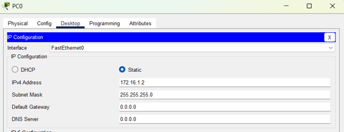

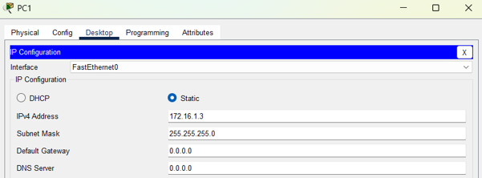

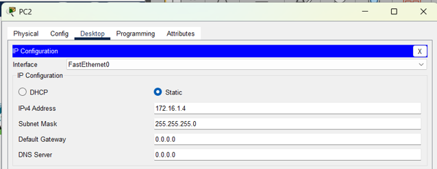

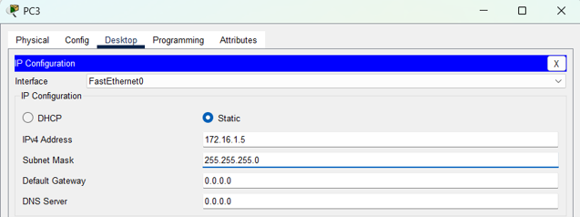

Observation:

All systems initially existed within the same subnet and were capable of communicating with one another.

---

### Step 3 – Verify Baseline Connectivity

Connectivity testing was performed before VLAN implementation.

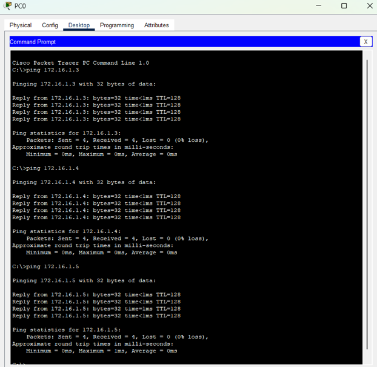

Result:

All devices responded successfully to ICMP requests.

This confirmed proper Layer 2 connectivity before segmentation was introduced.

---

### Step 4 – Create VLANs and Assign Access Ports

VLAN 20 and VLAN 30 were created on both switches.

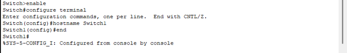

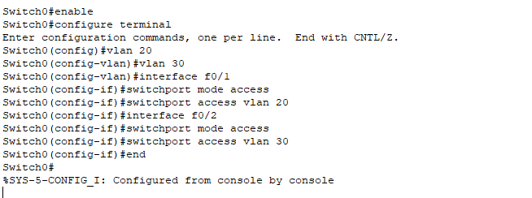

Port Assignments:

- VLAN 20 → PC0 and PC1
- VLAN 30 → PC2 and PC3

Purpose:

To logically separate traffic into independent broadcast domains.

---

### Step 5 – Verify VLAN Membership

Access port assignments were validated using Cisco IOS.

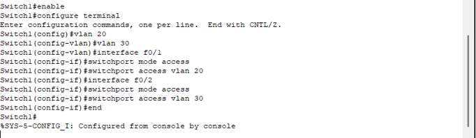

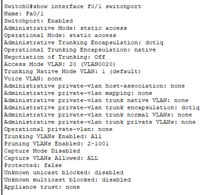

Verification confirmed that ports were assigned to the intended VLANs.

---

### Step 6 – Validate Segmentation

Connectivity testing was repeated after VLAN implementation.

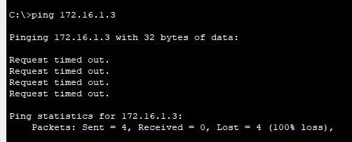

Observation:

Devices that previously communicated successfully could no longer communicate when assigned to separate VLANs.

This demonstrated VLAN-based traffic isolation.

---

### Step 7 – Investigate Same-VLAN Communication Failure

Although PC0 and PC1 belonged to VLAN 20, communication still failed because the VLAN traffic could not traverse between switches.

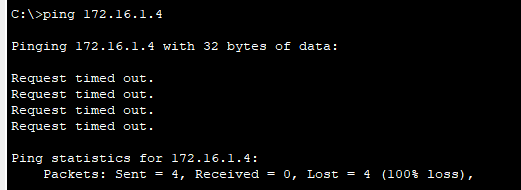

Key Finding:

VLAN membership alone does not permit communication across switches.

A trunk link is required to transport VLAN traffic.

---

### Step 8 – Configure IEEE 802.1Q Trunking

The inter-switch connection was converted into a trunk link.

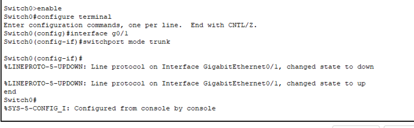

Purpose:

To allow multiple VLANs to traverse a single physical connection while preserving VLAN identification through tagging.

---

### Step 9 – Verify Trunk Operation

Trunk configuration was validated using Cisco IOS.

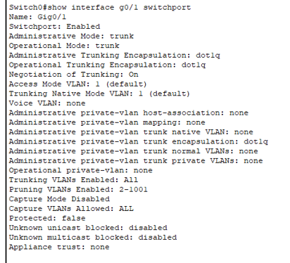

Verification confirmed:

- Administrative Mode: Trunk
- Operational Mode: Trunk
- Encapsulation: 802.1Q

---

### Step 10 – Validate Successful Communication

Connectivity testing was repeated after trunk implementation.

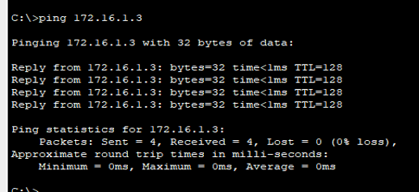

Result:

Devices within VLAN 20 successfully communicated across switches.

---

### Step 11 – Validate Continued Isolation

Traffic isolation remained intact after trunk implementation.

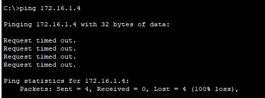

Result:

Devices assigned to different VLANs remained unable to communicate.

This confirmed successful implementation of network segmentation.### Final Result

- VLAN 20 devices could communicate with VLAN 20 devices.
- VLAN 30 devices could communicate with VLAN 30 devices.
- VLAN 20 and VLAN 30 remained isolated from each other.

---

## Research and Analysis

### Why VLANs Are Used

VLANs logically segment network traffic. This improves security, performance, and manageability by separating larger networks into smaller broadcast domains.

### Physical vs Logical Segmentation

Physical segmentation uses separate physical devices, cabling, and infrastructure. This is more expensive and less flexible.

Logical segmentation uses VLANs to separate traffic on shared switching infrastructure. This is more scalable and easier to manage in enterprise environments.

### Why Same-VLAN Devices Failed Before Trunking

Same-VLAN devices on different switches failed before trunking because VLAN traffic could not travel between switches without a trunk link. Access ports only carry traffic for one VLAN and are designed for endpoint devices.

### What 802.1Q Trunking Does

802.1Q tagging allows a trunk link to carry traffic for multiple VLANs across a single physical connection. A VLAN tag is added to Ethernet frames so switches can identify which VLAN the traffic belongs to.

### Why Different VLANs Cannot Communicate Without Layer 3 Routing

Different VLANs are separate Layer 2 broadcast domains. A Layer 3 device, such as a router or Layer 3 switch, is required to route traffic between VLANs.

---

## Enterprise Application

In enterprise environments, VLANs are used to separate users, departments, servers, guest devices, voice systems, security cameras, and sensitive systems.

This improves operational control and reduces risk because not every device should be able to communicate with every other device.

Examples:

- Guest wireless users should not access internal servers.
- Security cameras may need separation from standard user workstations.
- Finance systems may require isolation from general office devices.
- Voice traffic may require a separate VLAN for performance and management.

---

## Security Implications

This lab demonstrates how segmentation helps limit lateral movement.

If an attacker compromises one endpoint, VLAN segmentation can help contain the compromise by preventing unrestricted communication across the network.

Segmentation supports:

- Attack surface reduction
- Traffic isolation
- Containment during incidents
- Better network visibility
- Improved security architecture

---

## Skills Demonstrated

- VLAN Creation
- Access Port Configuration
- 802.1Q Trunk Configuration
- Cisco IOS CLI Usage
- Layer 2 Switching
- Network Segmentation
- ICMP Connectivity Testing
- VLAN Membership Verification
- Network Troubleshooting
- Technical Documentation
- Enterprise Network Design Concepts
- Security-Focused Network Thinking

---

## Screenshot Evidence

Screenshots are stored in the `Screenshots` folder and renamed in sequence to show the full lab progression:

- Initial topology
- PC IP configurations
- Default VLAN state
- Pre-segmentation connectivity
- VLAN creation
- Access port assignment
- VLAN verification
- Pre-trunk communication failure
- Trunk configuration
- Trunk validation
- Post-trunk connectivity testing
- Final segmentation validation

---

## Lessons Learned

1. VLANs provide logical segmentation across shared switching infrastructure.
2. Access ports place endpoints into a single VLAN.
3. Trunk links are required to carry VLAN traffic between switches.
4. Devices in different VLANs remain isolated unless Layer 3 routing is configured.
5. Network segmentation improves security, performance, and manageability.
6. Validation testing is required before and after network changes.
7. Network design decisions directly affect enterprise security posture.

---

## Portfolio Reflection

This lab helped me understand VLANs beyond just the commands. It showed how segmentation controls communication, how trunking carries VLAN traffic between switches, and how network design impacts security.

The biggest takeaway was that VLANs are a practical enterprise control. They help organizations separate systems, reduce unnecessary communication, and limit lateral movement after a compromise.

This lab strengthened my understanding of how networking fundamentals connect directly to enterprise support, cybersecurity, and infrastructure operations.
