# Inter-VLAN Routing Lab (Router-on-a-Stick)

## Overview

This lab demonstrates Inter-VLAN Routing using the Router-on-a-Stick (ROAS) method in Cisco Packet Tracer. The objective was to create multiple VLANs, verify traffic isolation, and then enable communication between VLANs through Layer 3 routing.

The lab simulates how organizations segment networks for security and performance while still allowing controlled communication between departments.

---

## Technologies Used

* Cisco Packet Tracer
* Cisco 2960 Switch
* Cisco 1941 Router
* VLAN Configuration
* 802.1Q Trunking
* Router-on-a-Stick (ROAS)
* IPv4 Addressing
* Inter-VLAN Routing

---

## Network Topology

The lab topology consisted of one Cisco 1941 router, one Cisco 2960 switch, and four end-user workstations.

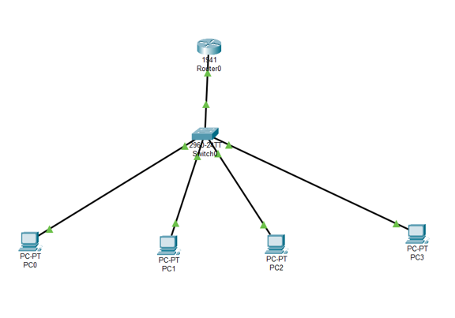

Two VLANs were created to simulate network segmentation between separate departments.

---

## IP Address Configuration

### VLAN 20 Devices

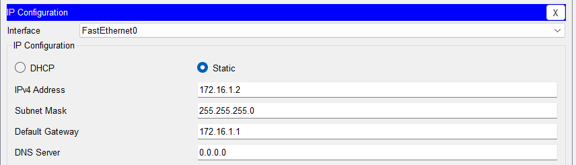

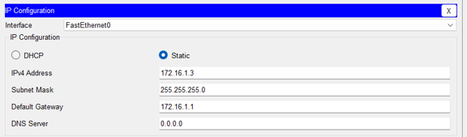

VLAN 20 devices were configured within the 172.16.1.0/24 network and assigned the default gateway of 172.16.1.1.

### VLAN 30 Devices

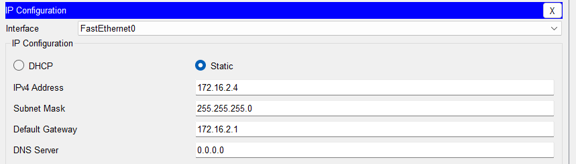

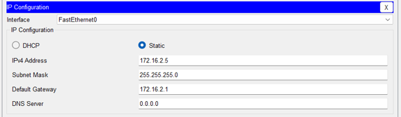

VLAN 30 devices were configured within the 172.16.2.0/24 network and assigned the default gateway of 172.16.2.1.

---

## VLAN Configuration

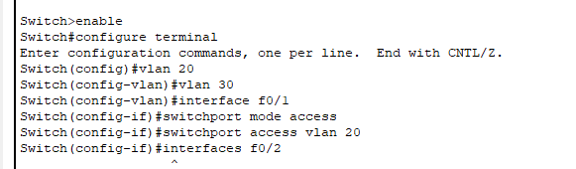

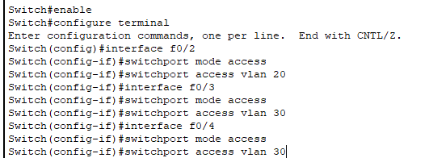

VLAN 20 and VLAN 30 were created on the switch and access ports were assigned to the appropriate VLANs.

---

## Trunk Configuration

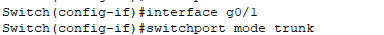

The connection between the switch and router was configured as an 802.1Q trunk. This allowed traffic from multiple VLANs to traverse a single physical connection.

---

## Router-on-a-Stick Configuration

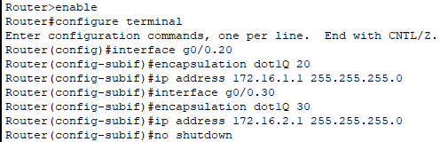

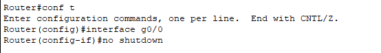

Router subinterfaces were configured using 802.1Q encapsulation. Each subinterface served as the default gateway for its respective VLAN.

---

## Validation Testing

### Same VLAN Communication

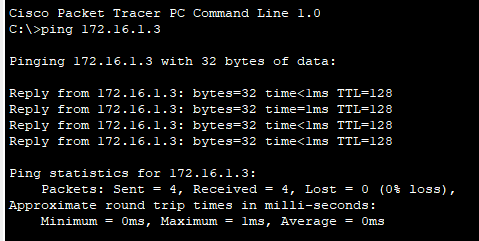

Devices within the same VLAN successfully communicated before routing was introduced.

### VLAN Isolation Verification

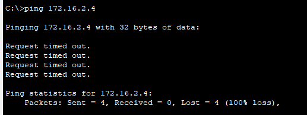

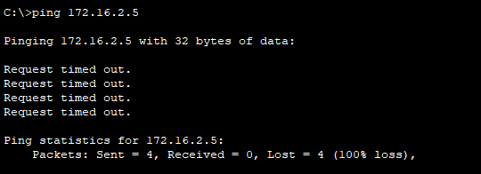

Before Inter-VLAN Routing was configured, devices in separate VLANs were unable to communicate. These failed ping tests confirmed that VLAN segmentation was functioning correctly.

### Additional VLAN Isolation Tests

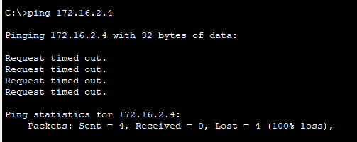

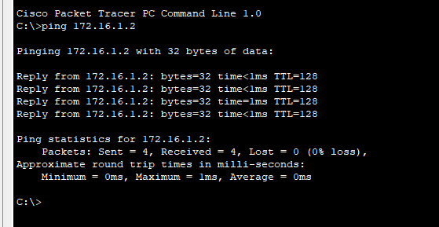

Additional testing further validated proper VLAN separation and same-VLAN communication.

---

## Inter-VLAN Routing Validation

After Router-on-a-Stick was configured, communication between VLAN 20 and VLAN 30 was successfully established.

### Post-Routing Testing

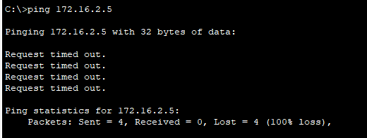

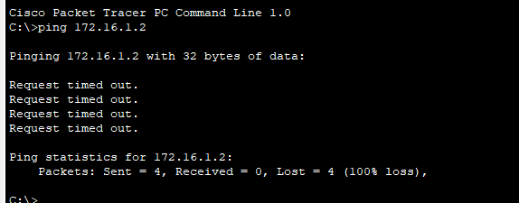

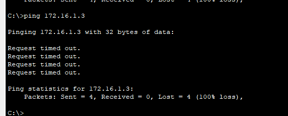

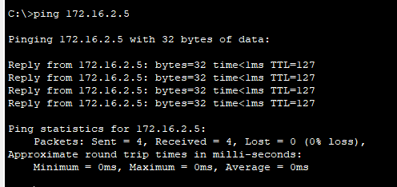

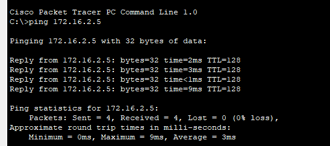

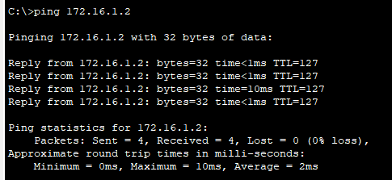

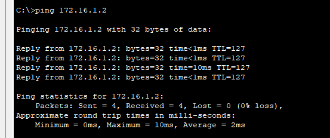

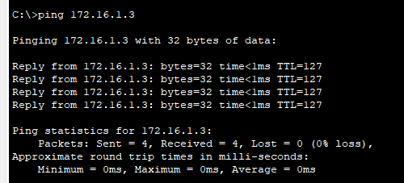

All cross-VLAN connectivity tests completed successfully, demonstrating proper Layer 3 routing between the segmented networks.

---

## Final Topology

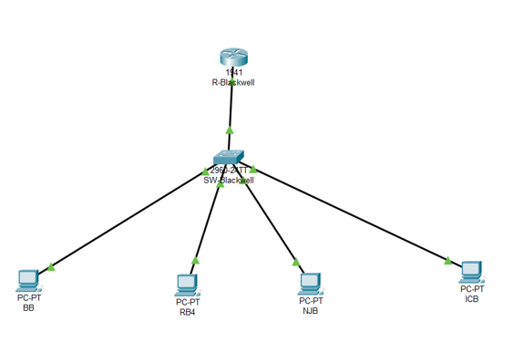

The completed topology demonstrates VLAN segmentation, 802.1Q trunking, and successful Inter-VLAN Routing using the Router-on-a-Stick method.

---

## Real-World Relevance

Organizations commonly use VLANs to separate departments, users, and security zones while maintaining centralized network infrastructure.

Inter-VLAN Routing allows isolated segments to communicate when business operations require it while still maintaining the benefits of network segmentation.

---

## Skills Demonstrated

* VLAN Creation and Management
* Cisco Switch Configuration
* 802.1Q Trunking
* Router-on-a-Stick Configuration
* IPv4 Addressing
* Layer 2 Segmentation
* Layer 3 Routing
* Connectivity Validation
* Network Troubleshooting
* Network Documentation

---

## Supporting Documentation

Additional implementation details, screenshots, research questions, and technical analysis are available in:

Documentation/InterVLAN_Routing_Lab_Implementation_Guide.docx