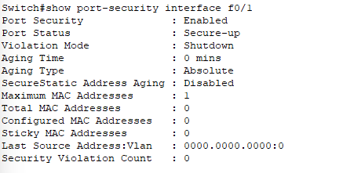
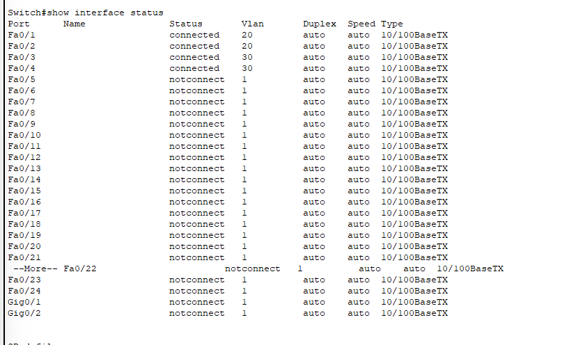
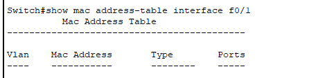
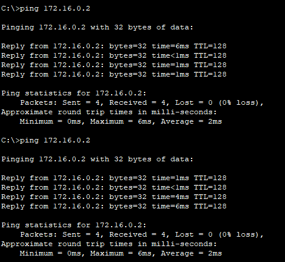
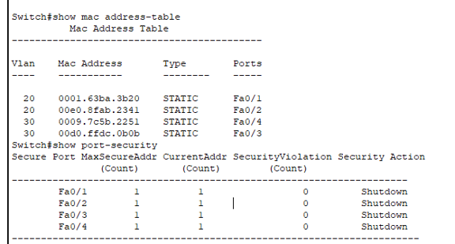
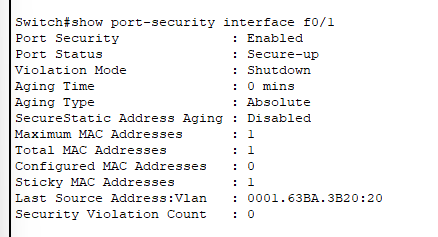

\# Network Security Hardening Lab Implementation Guide

\## My Thoughts and Research

As I worked through this lab, I wanted to understand more than just how to configure VLANs and port security. I wanted to understand why organizations implement these controls and how they help protect real-world networks.

One of the first concepts I researched was why unused switch ports can be dangerous. At first glance, an unused port may seem harmless, but in reality it can become an entry point for an attacker. If a malicious user gains physical access to an unused port, they may be able to connect a rogue device, launch malware, perform reconnaissance, or attempt to access sensitive resources. Because of this, organizations often disable unused ports or place them into isolated VLANs to reduce risk.

As I continued through the lab, I spent time learning about port security and how it is used in enterprise environments. Port security allows administrators to control which devices are permitted to connect to a switch port. This can be accomplished by limiting the number of MAC addresses allowed on an interface or by identifying specific MAC addresses that are authorized to use the port. Depending on the violation mode configured, the switch can either drop traffic or shut the port down entirely when an unauthorized device is detected.

Another area I wanted to understand was how segmentation contributes to security. Segmentation divides a network into smaller security zones and limits how traffic moves between them. By creating boundaries within the network, organizations can reduce the likelihood that a threat will spread from one area to another. Instead of allowing unrestricted communication between all devices, segmentation creates controlled pathways that require authorization before traffic can move between zones.

While researching additional security controls, I discovered that port security is only one layer of defense. Organizations often implement multiple safeguards to strengthen endpoint and network security. Examples include physical USB port blockers, BIOS or UEFI restrictions, endpoint detection and response (EDR) solutions, Group Policy restrictions, and locked device enclosures. At the network level, technologies such as IEEE 802.1X authentication can require users and devices to authenticate before receiving network access. Organizations may also deploy IDS and IPS solutions to provide real-time monitoring and threat detection.

One concept that stood out to me during this lab was Sticky MAC addressing. Sticky MAC allows a switch to dynamically learn the MAC address of a device connected to a specific interface and associate that address with the port. Once learned, the MAC address can be written into the running configuration and saved to the startup configuration. This creates a persistent association between the authorized device and the switch port.

The security benefit of Sticky MAC is straightforward. If an unauthorized device is connected to that port, the switch can enforce the configured violation action and prevent the device from communicating on the network. During my testing, I also learned an important troubleshooting lesson: Sticky MAC addresses are only learned when the switch actually sees traffic from the connected device.

The simple rule I took away from this lab was:

\*\*No traffic = no MAC = 0\*\*

When I initially checked the configuration, the switch showed zero learned MAC addresses. After generating traffic from the connected workstation, the switch was able to learn and associate the device's MAC address with the port as expected. This reinforced the importance of understanding how a feature behaves rather than simply assuming it is broken.

For this lab, I intentionally approached the configuration as if I were working in a production environment. Instead of relying solely on step-by-step instructions, I researched commands through Cisco documentation, Cisco community resources, and technical references. My goal was not simply to make the configuration work but to understand why each command existed and what security problem it was designed to solve.

From a security perspective, this lab demonstrates a common access-layer control used throughout enterprise environments. Port security helps establish trust at the network edge and reduces the likelihood that unauthorized devices can gain access to internal resources. While it is only one component of a broader security strategy, it remains a practical and effective control for protecting access-layer infrastructure.

Overall, this lab reinforced the relationship between segmentation, access control, endpoint trust, and defense-in-depth. More importantly, it showed how relatively simple switch configurations can significantly improve the security posture of a network when they are implemented correctly and supported by additional administrative and technical controls.

\# Troubleshooting and Validation

\## Issue Identified

While implementing port security, I noticed that Sticky MAC addresses were not being learned on the secured interfaces even though port security was enabled and the interfaces appeared operational.

\### Initial Observation

The MAC address table remained empty and the Sticky MAC count stayed at zero.

\### Interface Verification

To ensure the issue was not caused by a disconnected interface, I verified interface status and confirmed that all configured interfaces were active and connected.

\### MAC Table Verification

I then checked the MAC address table to determine whether the switch had learned any device addresses.

At this point no MAC addresses had been learned.

\### Investigation

After reviewing Cisco documentation and researching Sticky MAC behavior, I determined that port security can only learn MAC addresses when actual traffic is observed on the interface.

Although devices were connected, no traffic had yet been generated.

This led to the troubleshooting rule:

> No traffic = no MAC = 0

\### Resolution

To test this theory, I generated ICMP traffic between connected workstations using ping commands.

Once traffic began flowing across the secured interfaces, the switch immediately started learning MAC addresses.

\### Validation

After generating traffic, the MAC address table populated successfully.

The Sticky MAC bindings were then verified on the secured interfaces.

Validation confirmed:

- MAC addresses appeared in the MAC address table

- Entries were listed as STATIC due to Sticky MAC configuration

- Sticky MAC count increased to 1 on secured interfaces

- No security violations occurred

\## Key Takeaways

This troubleshooting exercise reinforced the importance of understanding how security controls function rather than assuming a configuration failure has occurred.

The issue was not a configuration problem. The issue was that the switch had not yet observed traffic and therefore had nothing to learn.

This lab demonstrated the importance of validating assumptions, generating evidence, and confirming results through testing before making configuration changes.

