\# Network Security Hardening Lab

\## Overview

This lab demonstrates foundational network hardening techniques using VLAN segmentation and Cisco switch port security. The objective was to reinforce network isolation, validate communication boundaries, and implement security controls that help protect access-layer infrastructure from unauthorized devices.

The lab simulates how organizations use segmentation and switch security features to reduce risk while maintaining required communication paths within the network.

---

\## Technologies Used

- Cisco Packet Tracer

- Cisco 2960 Switch

- VLAN Configuration

- Port Security

- Sticky MAC Addressing

- Access Port Configuration

- IPv4 Addressing

- Network Segmentation

- Network Hardening

---

- Network Segmentation Configuration

\# VLAN Creation

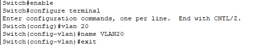

VLAN 20 and VLAN 30 were created to establish separate broadcast domains and provide logical segmentation between network resources.

---

\# Access Port Assignments

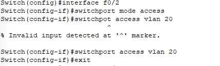

Ports Fa0/1 and Fa0/2 were assigned to VLAN 20.

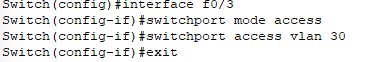

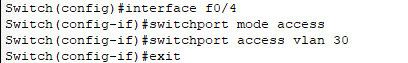

Ports Fa0/3 and Fa0/4 were assigned to VLAN 30.

---

- Configuration Verification

\# VLAN Membership Validation

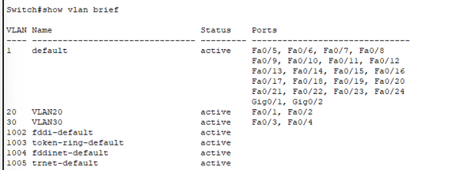

The VLAN database was reviewed to verify VLAN creation and correct port membership assignments.

\# Running Configuration Review

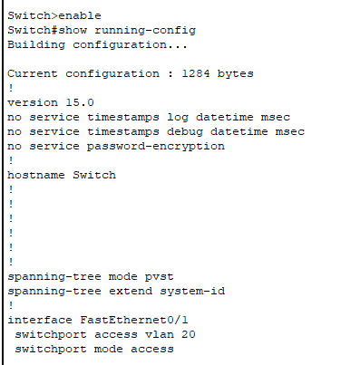

The running configuration was reviewed to confirm VLAN assignments and switch configuration.

\# Interface Status Verification

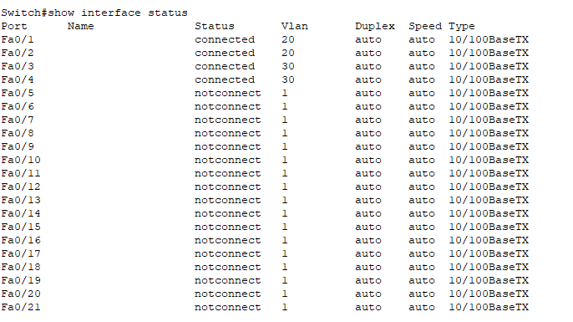

Interface status output confirmed that connected ports were operational and assigned to the correct VLANs.

---

- Connectivity Validation

\# VLAN 20 Communication

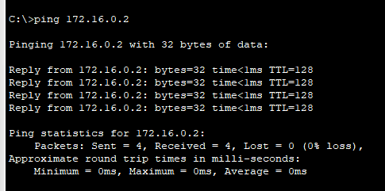

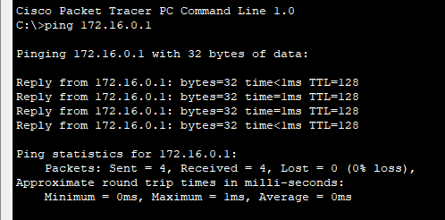

Devices within VLAN 20 successfully communicated, confirming proper Layer 2 connectivity.

\# VLAN 30 Communication

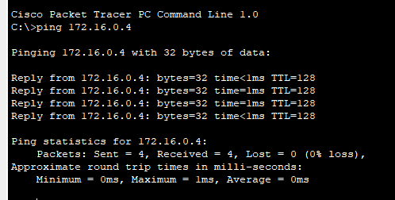

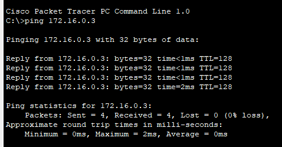

Devices within VLAN 30 successfully communicated, confirming proper VLAN membership and connectivity.

## Cross-VLAN Isolation Testing

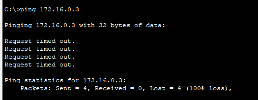

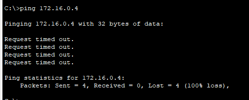

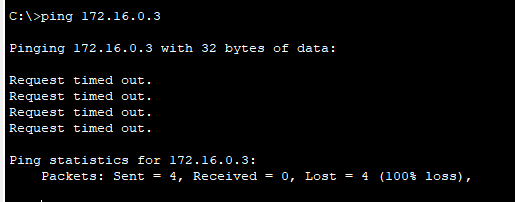

Cross-VLAN communication attempts failed as expected. These failures confirmed that segmentation was functioning correctly and that traffic was isolated between VLANs.

---

## Port Security Implementation

## Initial Configuration and Troubleshooting

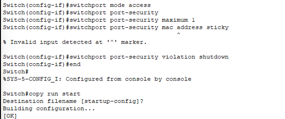

During implementation, configuration syntax and command behavior were reviewed and corrected as part of the hardening process.

## Port Security Validation

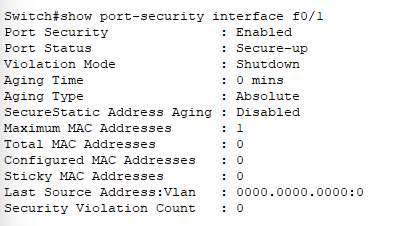

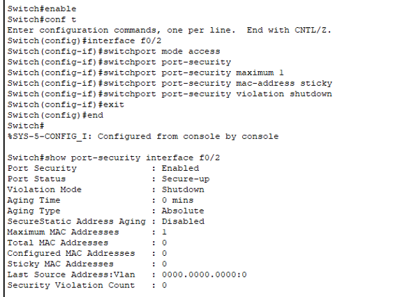

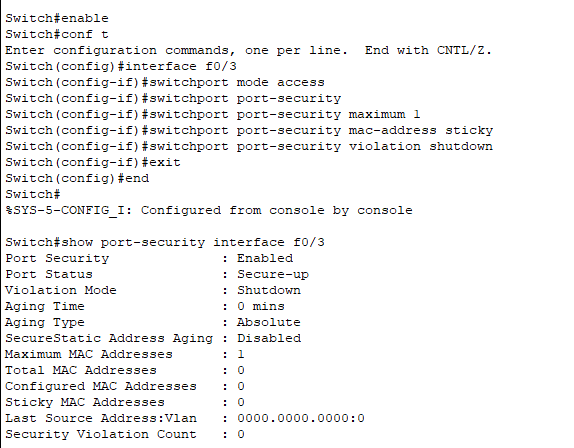

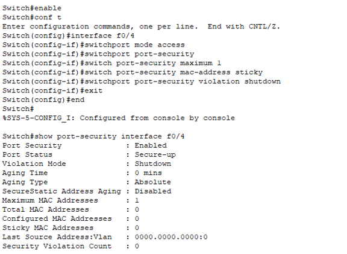

Port security was enabled on all active access ports. The configuration limited each interface to a single MAC address and enforced shutdown mode upon violation.

---

## Final Configuration Validation

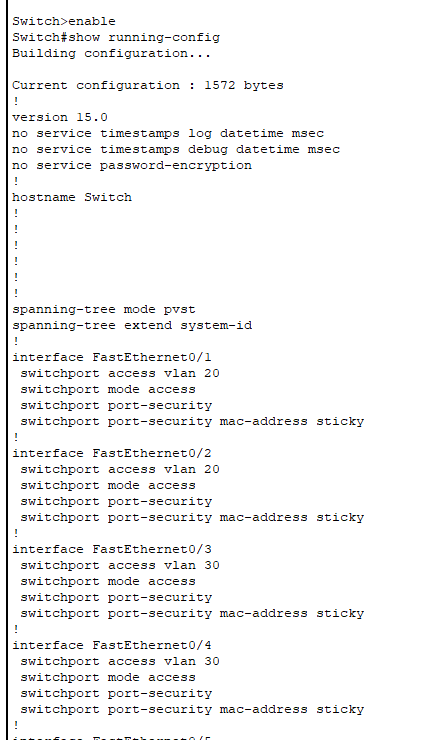

The final running configuration confirmed that VLAN segmentation and port security controls were successfully implemented across the switch.

---

## Security Benefits

The security controls implemented in this lab provide several important protections:

- Limits unauthorized device connections

- Restricts MAC address learning

- Reduces opportunities for rogue device access

- Reinforces network segmentation

- Supports defense-in-depth principles

- Reduces opportunities for lateral movement

---

- Real-World Relevance

Organizations commonly implement VLAN segmentation and port security to protect access-layer switches from unauthorized devices and reduce risk within enterprise environments.

These controls are frequently found in corporate offices, healthcare environments, government networks, educational institutions, and data centers where network access must be carefully controlled.

---

- Skills Demonstrated

- VLAN Creation and Management

- Access Port Configuration

- Network Segmentation

- Connectivity Validation

- Port Security Configuration

- Sticky MAC Addressing

- Configuration Verification

- Network Hardening

- Network Troubleshooting

- Security Validation

- Technical Documentation

---

- Supporting Documentation

- \[Implementation Guide](Documentation/Network_Security_Hardening_Implementation_Guide.md)

- Network_Security_Hardening_Implementation_Guide.docx

